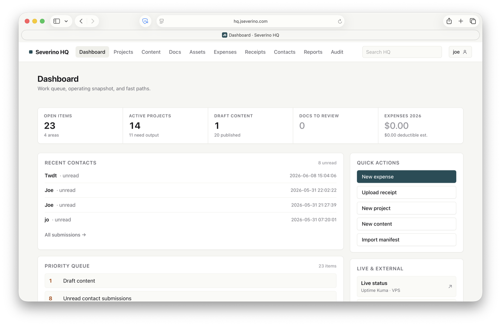
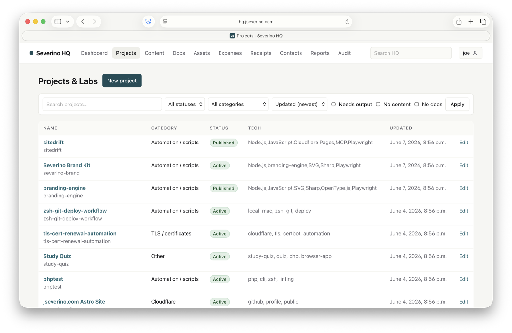
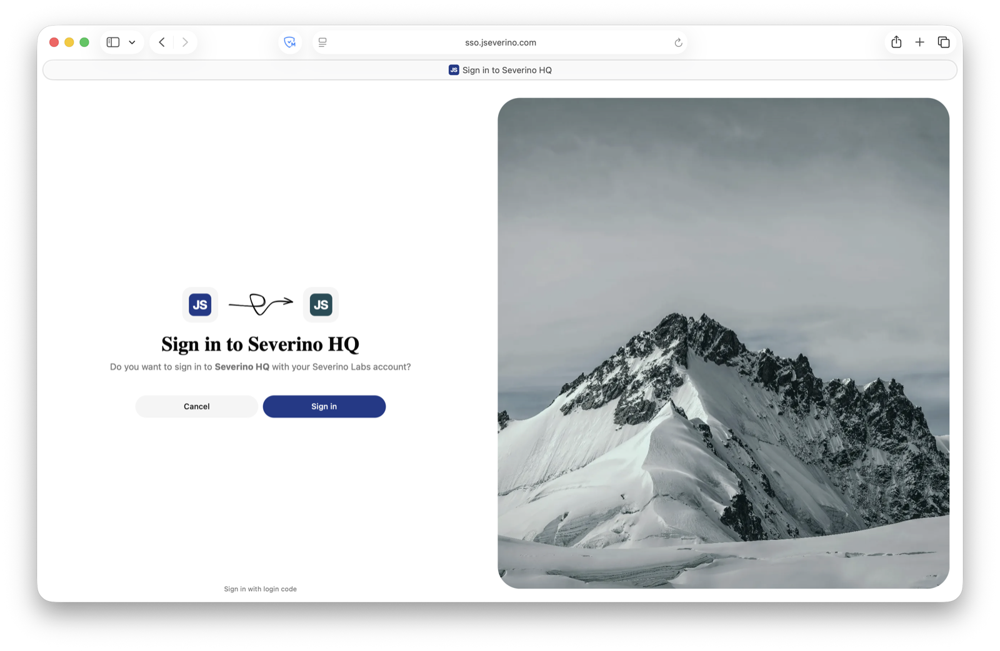
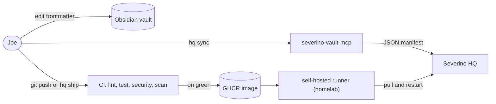

# Severino HQ

[](https://github.com/joeseverino/severino-hq/actions/workflows/ci.yml)
&nbsp;
&nbsp;

The private internal operating system behind Severino Labs.



Severino HQ connects projects/labs, content ideas, documentation index records,
assets, expenses, receipts, basic reports, and AI-readable exports — so a
single source of truth links a router purchase to the expense, the receipt,
the project it powers, the article it inspired, the runbook that documents it,
and the year-end summary it rolls up into.

This app is **not** the public website, a SaaS product, a CRM, or an
accounting system. It runs on the homelab / a small Linux VPS, accessible only
over Tailscale.

---

## Stack

- Django 5 + SQLite (PostgreSQL is a future option)
- Django templates (HTMX hook left in `base.html` for future use)
- Plain CSS (no build step, no CDN runtime dependencies)
- Django auth, Django admin, Django ORM and migrations
- Environment variables for secrets

## Modules

1. Dashboard — KPIs, needs-attention queue, quick actions, relationship
   health, recent activity, docs needing review.
2. Projects / Labs — CRUD with category/status, technologies, repo & public URLs.
3. Content Pipeline — CRUD with type, status, WordPress IDs, related records.
4. Documentation Index — metadata + relationships only; Obsidian stays the source of truth.
5. Assets / Equipment — purchase data + auto-computed estimated deductible.
6. Expenses — categorized line items + auto-computed estimated deductible.
7. Receipts — uploaded outside app code, served only via auth-protected view.
8. Reports / Exports — KPI page + CSV exports + year-summary JSON & Markdown.
9. Audit Log — every important create/update/delete/login/upload/export.
10. MCP-ready — stable IDs/slugs, JSON exports with relationships, AI-readable Markdown.

---

## Operator UI

The app is intentionally dense and practical: list pages stay table-first, the
dashboard surfaces work that needs attention, and global search is always
available in the header.

- The top navigation highlights the active section and stays on one row on
  desktop. If the viewport is narrow, the nav scrolls horizontally instead of
  wrapping into stacked links.
- Account actions (Admin, Sign out) sit in a dropdown under your username,
  keeping the header nav compact.
- Header search goes to `/search/` and searches projects, content, docs,
  assets, expenses, and receipts.
- The dashboard "needs attention" queue links to filtered cleanup views for
  docs needing review and draft content.
- Dashboard quick actions link to the common create/import flows: new expense,
  upload receipt, new project, new content, and Docs manifest import.
- Relationship health counts are status indicators, not blockers; non-zero
  values mean there is link or metadata cleanup worth doing.

Table-first list pages keep the relational data dense and scannable:



Sign-in is OIDC SSO against a self-hosted **Pocket ID** (Tailscale-only,
passkey-first); the Django password form stays as the break-glass path:



---

## How changes reach HQ

Every operator action lands through a *checked* path — content through a shared
schema, code through a gated pipeline. The Obsidian vault stays the source of
truth; only validated metadata and tested images ever reach HQ.



**Content — `hq sync`.** Severino HQ never reads the vault directly. The `hq`
CLI calls the local `severino-vault-mcp` server to walk the vault frontmatter
and emit one JSON manifest, then pipes it into `manage.py import_docs_manifest`.
The importer validates every record against
[`docs_index/schema.json`](docs_index/schema.json) — the frontmatter enum
contract single-sourced from the MCP and committed here — so HQ can never accept
a value the MCP wouldn't emit, and vice-versa. Records upsert by `doc_id`;
runbook bodies and secrets never enter HQ.

**Code — `git push` / `hq ship`.** A push to `main` runs the gated pipeline in
[`.github/workflows/ci.yml`](.github/workflows/ci.yml): lint, tests on Python
3.12/3.13, a `check --deploy` posture gate plus `pip-audit`, then a GHCR image
build that Trivy scans. Only on green does a **self-hosted runner on the
homelab** pull the scanned image and restart the container — the runner dials
out to GitHub, so nothing inbound is ever opened. A red commit physically cannot
reach the box.

---

## Local development

```bash
# 1. Clone & enter
git clone <your-mirror> severino-hq
cd severino-hq

# 2. Virtualenv + deps
python3 -m venv .venv
source .venv/bin/activate
pip install -r requirements.txt

# 3. Environment
cp .env.example .env
# (for dev you can leave DEBUG=0 with a real SECRET_KEY, or set DEBUG=1)

# 4. DB + first user
python manage.py migrate
python manage.py createsuperuser

# 5. Optional demo data
python manage.py seed_demo

# 6. Run the dev server (bind to localhost only)
DJANGO_DEBUG=1 DJANGO_ALLOWED_HOSTS=127.0.0.1 \
  python manage.py runserver 127.0.0.1:8000
```

Open <http://127.0.0.1:8000/>, sign in. Admin lives at `/admin/`.

### Importing a documentation manifest

Severino HQ does **not** read your Obsidian vault directly. Export a JSON
manifest from the vault (one entry per doc) and import it:

```bash
python manage.py import_docs_manifest path/to/docs_manifest.json
```

Or upload the file through the UI at **Docs → Import manifest**. See
`docs_index/importer.py` for the schema.

---

## Production deployment

Severino HQ runs **homelab / small VPS, reachable only over Tailscale**: the app
binds to localhost (or the Tailscale interface), a reverse proxy terminates TLS,
and the public internet never sees it.

Day to day it deploys through the gated pipeline in
[How changes reach HQ](#how-changes-reach-hq) — a push to `main` ships a
Trivy-scanned image that a self-hosted homelab runner pulls and restarts.
[`docs/DEPLOYMENT.md`](docs/DEPLOYMENT.md) has the from-scratch recipes:
containerized (Docker Compose with named volumes for SQLite / receipts /
exports, optional Tailscale sidecar) and systemd + Caddy/Nginx on a VPS.

See [`docs/SECURITY.md`](docs/SECURITY.md) for the production security checklist
and [`docs/BACKUP.md`](docs/BACKUP.md) for SQLite-safe backup & restore
(`VACUUM INTO` + `age` / `restic`). The roadmap — clients, invoices, the
WordPress bridge, Postgres migration — is in
[`docs/ROADMAP.md`](docs/ROADMAP.md).

---

## v1 quality bar

- Clean relational design (everything linkable: asset ↔ expense ↔ receipt ↔ project ↔ content ↔ doc).
- Authentication required on every URL except `/accounts/login/`, `/oidc/`,
  and `/static/`. Sign-in is OIDC SSO against a self-hosted Pocket ID
  (Tailscale-only), gated by allowed email or group, with Django password
  login kept as the break-glass path.
- DEBUG off in production, SECRET_KEY from env, ALLOWED_HOSTS explicit, secure cookies.
- Uploaded receipts stored outside app code and served only through an auth-protected view.
- Audit logging on every CRUD action, login event, upload, and export.
- AI-readable Markdown export + relationship-aware JSON export, consumed by the
  local `severino-vault-mcp` server.
- Boring, reliable architecture. No SaaS dependencies.
