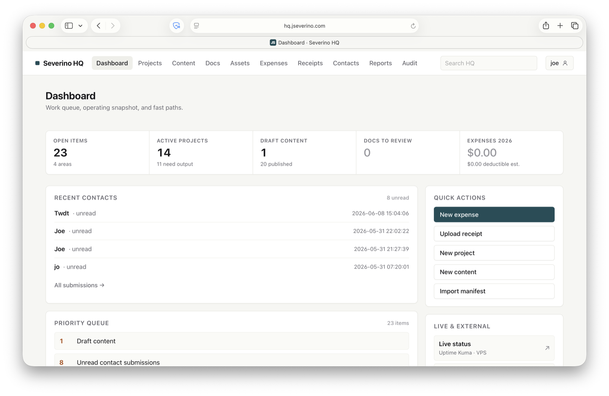
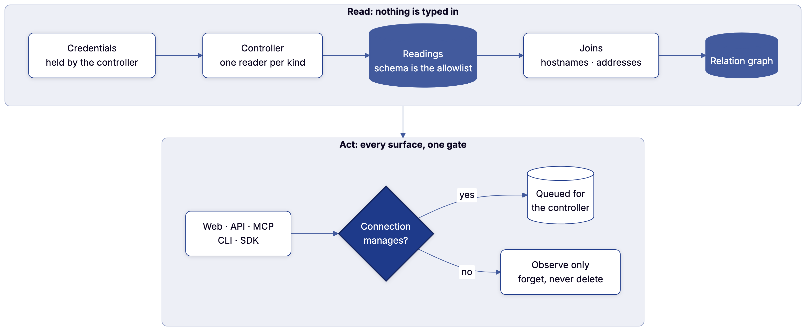
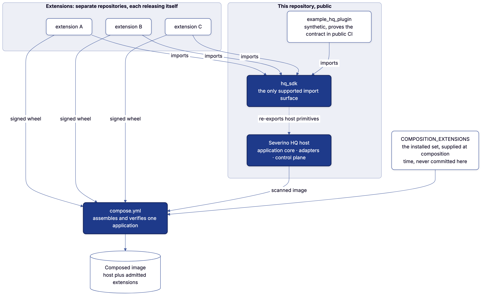
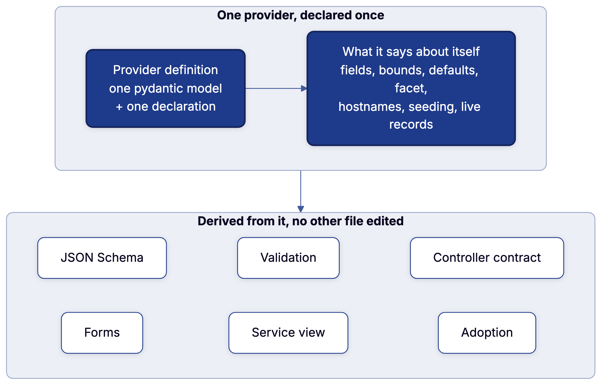
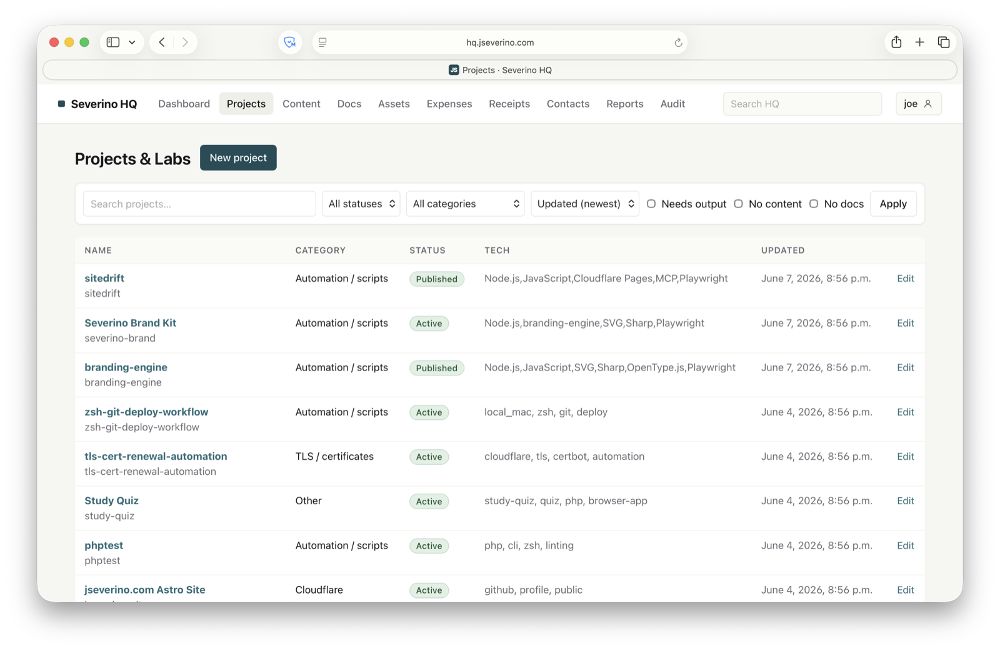
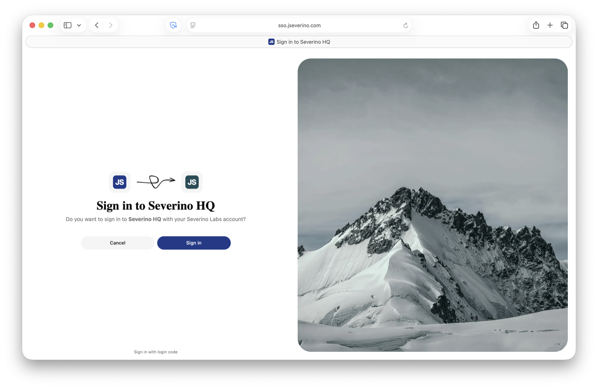
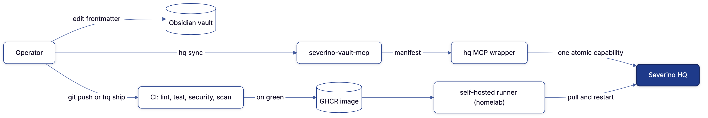

# Severino HQ

[](https://github.com/joeseverino/severino-hq/actions/workflows/ci.yml)
&nbsp;
&nbsp;

A self-hosted operations hub that derives its picture of your infrastructure
from the credentials you give it. Connect a Cloudflare token and a Tailscale
credential, and machines, services, domains and the relationships between them
are read, joined and kept current. Every change goes through one gated path that
the web UI, the API, MCP, the CLI and the SDK all share.

HQ is also a host: private extensions add whole domains to it, and this
repository names none of them. It holds the contracts they meet at, which is
why it can be public while they are not.



Severino HQ connects projects/labs, content ideas, documentation index records,
assets, expenses, receipts, basic reports, and AI-readable exports, so a
single source of truth links a router purchase to the expense, the receipt,
the project it powers, the article it inspired, the runbook that documents it,
and the year-end summary it rolls up into.

It is **not** a public website, a SaaS product, a CRM, or an accounting
system. It runs on a home server or a small VPS, reachable only over Tailscale.

## Derived, not authored

Nothing about the infrastructure is typed into a file. A controller holds the
credentials and reads what each one can see; HQ stores those readings, joins
them, and derives the rest.

- **Readings.** Each kind (a DNS record, a tailnet device, an Access
  application, a registration) is declared once in
  [`control_plane/observations/`](control_plane/observations/). Its schema is
  the allowlist for what is stored, and a refused read says which permission
  would allow it.
- **Joins.** Readings are matched to machines, services and domains by
  hostname and address, into one relation graph. The machine, service and
  domain pages, the topology, search and the dashboard all read that graph, so
  they cannot disagree.
- **Derived facts.** A machine's roles (exit node, tailnet DNS), its own LAN
  and public addresses, where HQ itself runs, and which actions a resource
  offers all follow from what was read.
- **Writes.** A record is adopted, reconciled, renewed or removed only through
  a connection that declares `manages`. HQ enforces that on every write path,
  and the controller enforces it again.



<sup>Diagram source: [`docs/diagrams/derived-estate.mmd`](docs/diagrams/derived-estate.mmd),
pre-rendered with [`diagram`](https://github.com/joeseverino/tools/blob/main/bin/diagram).</sup>

Onboarding is the connections page: it shows what each credential can see,
and [`scripts/`](scripts/) mints least-privilege Cloudflare and Tailscale
credentials for it. The design is written up in
[`docs/DERIVED_FACTS.md`](docs/DERIVED_FACTS.md).

## From knowing to doing

A reading is not finished when it is correct. It is finished when it says what
it means, how old its evidence is, what to do next, and whether that worked. The
same context and capabilities serve the browser and an AI assistant, so a
workflow can move between them without acquiring different rules.

A service, for example, ties its hostname to DNS, ingress, certificate, and
machine. A finding leads from that dependency evidence to an authorized remedy,
then to verification from fresh facts. HQ derives those connections from the
operational records it already keeps, rather than asking the operator to
maintain another diagram.

For a code review, start with the [application boundary](docs/APPLICATION_ARCHITECTURE.md),
the [extension contract](docs/PLUGINS.md), and the
[local verification gate](scripts/check.sh). The public tests compose synthetic
extensions so the design can be inspected without access to the private installation.

## The host does not know its extensions

The domains HQ runs ship as separately released, signed packages from their own
repositories. This repository names none of them: no inventory, no repository
identifiers, no routes, no models, no vocabulary.

That is an architectural rule before it is a privacy one. A host that names an
extension has taken a dependency on it, and three properties stop holding: add
an extension without touching the host, run the host with none installed,
release the two on independent schedules.

The boundary is enforced in both directions. `python -m hq_sdk.validation`
rejects an extension importing anything but `hq_sdk`, against a package list
derived from the host tree rather than hand-maintained, so it cannot fall behind
as the host grows. Two contract tests check the reverse (that no host file
names an installed extension) taking the names from runtime composition rather
than from anything committed, since a list of them here would be the coupling
they look for. Public examples use the synthetic `example.*` namespace, which
lets the contract be demonstrated in public CI without the host gaining a real
consumer.



<sup>Diagram source: [`docs/diagrams/host-and-extensions.mmd`](docs/diagrams/host-and-extensions.mmd),
pre-rendered with [`diagram`](https://github.com/joeseverino/tools/blob/main/bin/diagram).</sup>

How that assembly is triggered, fingerprinted and deployed is under
[How changes reach HQ](#how-changes-reach-hq); the contract an extension
implements is [`docs/PLUGINS.md`](docs/PLUGINS.md).

---

## Stack

- Django 6.1 + SQLite (PostgreSQL is a future option)
- Django templates, server-rendered; JavaScript progressively enhances
- Plain CSS (no build step, no CDN runtime dependencies)
- Django auth, Django admin, Django ORM and migrations
- Environment variables for secrets

## One application core, every interface

The web UI, the HTTP API, MCP, the management CLI and the extension SDK share
the same application services.
Adapters parse and render; `application/` owns validation, transactions,
persistence, audit attribution, and canonical results. The reference project
slice and documentation sync mutation are described in
[`docs/APPLICATION_ARCHITECTURE.md`](docs/APPLICATION_ARCHITECTURE.md).
Trusted, installable modules use the domain-neutral, versioned
[`plugin contract`](docs/PLUGINS.md); a generic conformance plugin proves the
contract in public CI without coupling HQ to any private module.

Infrastructure follows the same rule, and HQ is both halves of it: it derives
what exists from what its credentials reach and what its sweeps find, and it
authors what should be configured. The controller reconciles only explicitly
enabled capabilities, reports back both observed state and the full provider inventory,
and holds every provider credential: those never enter HQ persistence or the
web process.

Because the controller reports everything a provider holds rather than only the
records HQ created, HQ can show what it does not manage and adopt it, capturing
the live settings verbatim so the first reconciliation after adopting changes
nothing.

HQ also derives one actionable topology from those same contracts: controllers
carry connections, connections enable abilities and reach targets, and abilities
govern declared resources. The web explorer, HTTP API, and MCP expose the same
normalized graph; its actions invoke the existing application capabilities, so
there is no second source of truth or graph-only mutation path.
Any node can be traced inbound or outbound through a bounded number of hops,
turning that same projection into dependency and blast-radius answers before an
operator or agent invokes one of those actions.


<sup>Diagram source: [`docs/diagrams/infrastructure-control-plane.mmd`](docs/diagrams/infrastructure-control-plane.mmd),
pre-rendered with [`diagram`](https://github.com/joeseverino/tools/blob/main/bin/diagram).</sup>

A provider is declared once, as a pydantic model plus a short statement of how
it participates. Its schema, its validation, the controller's contract, the
generated create-and-edit forms, the service view, and adoption are all derived
from that one declaration.



<sup>Diagram source: [`docs/diagrams/provider-registry.mmd`](docs/diagrams/provider-registry.mmd),
pre-rendered with [`diagram`](https://github.com/joeseverino/tools/blob/main/bin/diagram).</sup>

## Modules

1. Dashboard: KPIs, needs-attention queue, quick actions, relationship
   health, recent activity, docs needing review.
2. Projects / Labs: CRUD with category/status, technologies, repo & public URLs.
3. Content Pipeline: CRUD with type, status, WordPress IDs, related records.
4. Documentation Index: metadata + relationships only; Obsidian stays the source of truth.
5. Assets / Equipment: purchase data + auto-computed estimated deductible.
6. Expenses: categorized line items + auto-computed estimated deductible.
7. Receipts: uploaded outside app code, served only via auth-protected view.
8. Reports / Exports: KPI page + CSV exports + year-summary JSON & Markdown.
9. Audit Log: every important create/update/delete/login/upload/export.
10. Services: every hostname, and whether its DNS, ingress and certificate are
    in place, composed from the resources behind it rather than stored.
11. Infrastructure: desired state HQ authors and edits, what the providers
    actually hold, adoption of what they hold and HQ does not, drift,
    certificate issuance and installation, and audited reconciliation.
12. MCP-ready: stable IDs/slugs, JSON exports with relationships, AI-readable Markdown.

---

## Operator UI

The app is intentionally dense and practical: list pages stay table-first, the
dashboard surfaces work that needs attention, and global search is always
available in the header.

- The top navigation highlights the active section and stays on one row on
  desktop. If the viewport is narrow, the nav scrolls horizontally instead of
  wrapping into stacked links.
- Operator utilities (Action items, Admin, Sign out) sit in a dropdown under
  your username, keeping the domain nav compact. When anything is unread, its
  count sits beside your username. It is fetched after the page renders, so no
  page assembles the queue just to draw the header.
- Header search and <kbd>Ctrl/⌘ K</kbd> open Command Center. It searches
  destinations, records, devices, content, connections, and authorized
  commands; Enter opens the selected result or the complete `/search/` result
  set.
- `/action-items/` is the complete cross-domain queue. The dashboard is its
  compact preview; host domains and installed extensions emit the same Insight
  contract, and derived infrastructure findings link through to their evidence
  and safe existing remedies. An Insight may carry quick actions, posted to
  their owner's route; a held approval uses them for Approve and Reject.
- Items can be marked read, per person. A read item is unread again once it
  changes: its count, detail or status.
- Headline metrics lead the dashboard, grouped by their runtime contributor,
  with a compact attention preview in the utility rail. Contributors with several readings
  get a compact overview; their existing typed summary supplies its reporting
  window and optional chart and calendar, visible without expanding a panel. Single readings stay in
  the shared metric strip. No installed domain names are encoded in the layout.
  The full queue retains each entry's severity, recommended next step, and any
  supplied resolution workflow. Snapshot ages remain visible on mobile, and
  readings at least an hour old are marked out of date.
- Dashboard at-a-glance readings are refreshed by a POST, from the refresh
  button or from the dashboard opening on a reading over five minutes old;
  viewing them never requests one. They are timestamped and owned by their
  source records. Host telemetry belongs to the selected machine
  declaration; weather belongs to the configured NWS point. The page does not
  continuously poll either provider.
- Relationship health counts are status indicators, not blockers; non-zero
  values mean there is link or metadata cleanup worth doing.

Table-first list pages keep the relational data dense and scannable:



Sign-in is OIDC SSO against a self-hosted **Pocket ID** (Tailscale-only,
passkey-first). With SSO on, password sign-in is off; an operator with host
access can turn it back on (`SEVERINO_PASSWORD_LOGIN_ENABLED`) as a break-glass
path:



---

## How changes reach HQ

Every operator action lands through a *checked* path: content through a shared
schema, code through a gated pipeline. The Obsidian vault stays the source of
truth; only validated metadata and tested images ever reach HQ.



<sup>Diagram source: [`docs/diagrams/changes-reach-hq.mmd`](docs/diagrams/changes-reach-hq.mmd),
pre-rendered with [`diagram`](https://github.com/joeseverino/tools/blob/main/bin/diagram).</sup>

**Content: `hq sync`.** Severino HQ never reads the vault directly. The
[`hq`](https://github.com/joeseverino/tools) CLI calls the local
[`severino-vault-mcp`](https://github.com/joeseverino/severino-vault-mcp)
server to emit one JSON manifest, then sends it to HQ through one authenticated
`hq.sync` MCP capability call. HQ validates and commits it atomically, with no SSH,
temporary server payload, or partial sync. The
importer validates every record against
[`docs_index/schema.json`](docs_index/schema.json): the frontmatter enum
contract single-sourced from the MCP and committed here, so HQ can never accept
a value the MCP wouldn't emit, and vice-versa. Records upsert by `doc_id`;
runbook bodies and secrets never enter HQ.

**Code: `git push` / [`hq ship`](https://github.com/joeseverino/tools).** A push to `main` runs the gated pipeline in
[`.github/workflows/ci.yml`](.github/workflows/ci.yml): lint, tests on Python
3.12/3.13/3.14, a `check --deploy` posture gate plus `pip-audit`, and a booted
production-image readiness check that Trivy scans. On `main`, the same gated
image is published to GHCR. Only on green does a **self-hosted runner on the
homelab** deploy it: the runner dials out to GitHub, so nothing inbound is ever
opened. A red commit physically cannot reach the box.

What the box actually runs is one **composed** image: that scanned host plus
every admitted extension, assembled and verified as a single application by
[`.github/workflows/compose.yml`](.github/workflows/compose.yml). Extensions
verify and admit themselves in their own repositories and publish signed
bundles; they never build or deploy an image, and they cannot trigger the host.
The composition runs on a schedule instead and rebuilds only when its inputs
(host image, wheel digests, admission policy) actually change, so an extension
release reaches production on its own without either repository holding a
credential for the other. See [`docs/PLUGINS.md`](docs/PLUGINS.md#composition).

---

## Local development

Coding agents and contributors should read [`AGENTS.md`](AGENTS.md) first. It
contains the one-page architecture map, placement rules, the host/extension
boundary, frontend standards, and definition of done. After setup, the entire
local quality gate is one command:

```bash
./scripts/check.sh
```

and everything the pipeline will check is one more:

```bash
./scripts/ci-local.sh
```

Both read an optional, gitignored `.env.dev` for the things only your machine
knows, which interpreter has the extensions importable, where their sources
are, and which to enable. Copy [`scripts/dev.env.example`](scripts/dev.env.example)
and fill it in. Without it both commands still run, but quietly cover less:
`check.sh` skips the composed pass, which is the one that catches what public
CI cannot, because the host and its extensions first meet there.

Browser layout regressions are an optional development gate, separate from
production dependencies:

```bash
.venv/bin/python -m pip install -r requirements-browser.txt
.venv/bin/python -m playwright install chromium
DJANGO_DEBUG=true .venv/bin/python manage.py test core.browser_tests --parallel=1
# Or include browser checks in the full gate:
CHECK_BROWSER=1 ./scripts/check.sh
```

The suite renders the real dashboard templates and stylesheet with synthetic
`example.*` contributors, without database access or integration requests.
It checks paired-card alignment, sidebar independence, 320/390/768px layouts,
and the host without overview contributors. JavaScript is disabled to protect
the server-rendered baseline. Failures save synthetic viewport screenshots to
an OS temporary directory, never private-account snapshots or tracked baselines.
Set `HQ_BROWSER_ENGINE=webkit` or `firefox` after installing that engine to run
the same assertions there. An existing Edge installation can be selected with
`HQ_BROWSER_CHANNEL=msedge` instead of downloading Chromium. See the
[Playwright browser documentation](https://playwright.dev/python/docs/browsers).

```bash
# 1. Clone & enter
git clone <your-mirror> severino-hq
cd severino-hq

# 2. Virtualenv + deps
python3 -m venv .venv
source .venv/bin/activate
pip install -r requirements.txt

# 3. Environment
cp .env.example .env
# (for dev you can leave DEBUG=0 with a real SECRET_KEY, or set DEBUG=1)

# 4. DB + first user
python manage.py migrate
python manage.py createsuperuser

# 5. Optional demo data
python manage.py seed_demo

# 6. Run the production-like ASGI dev server (binds to localhost only)
./scripts/dev.sh
```

Open <http://127.0.0.1:8000/>, sign in. Admin lives at `/admin/`.

The script collects versioned assets, then runs Uvicorn with reload enabled.
Using the same ASGI path as production means local browser checks exercise
compression, cache headers, and routing instead of Django `runserver`'s
development-only static handler.

### Importing a documentation manifest

Severino HQ does **not** read your Obsidian vault directly. Export a JSON
manifest from the vault (one entry per doc) and import it:

```bash
python manage.py import_docs_manifest path/to/docs_manifest.json
```

Or upload the file through the UI at **Docs → Import manifest**. See
`docs_index/importer.py` for the schema.

---

## Production deployment

Severino HQ runs **homelab / small VPS, reachable only over Tailscale**: the app
binds to localhost (or the Tailscale interface), a reverse proxy terminates TLS,
and the public internet never sees it.

Day to day it deploys through the gated pipeline in
[How changes reach HQ](#how-changes-reach-hq): a push to `main` ships a
Trivy-scanned image that a self-hosted homelab runner pulls and restarts.
[`docs/DEPLOYMENT.md`](docs/DEPLOYMENT.md) has the from-scratch recipes:
containerized (Docker Compose with named volumes for SQLite / receipts /
exports, optional Tailscale sidecar) and systemd + Caddy/Nginx on a VPS.

See [`docs/SECURITY.md`](docs/SECURITY.md) for the production security checklist
and [`docs/BACKUP.md`](docs/BACKUP.md) for SQLite-safe backup & restore
(`VACUUM INTO` + `age` / `restic`). The roadmap (clients, invoices, the
WordPress bridge, Postgres migration) is in
[`docs/ROADMAP.md`](docs/ROADMAP.md).
