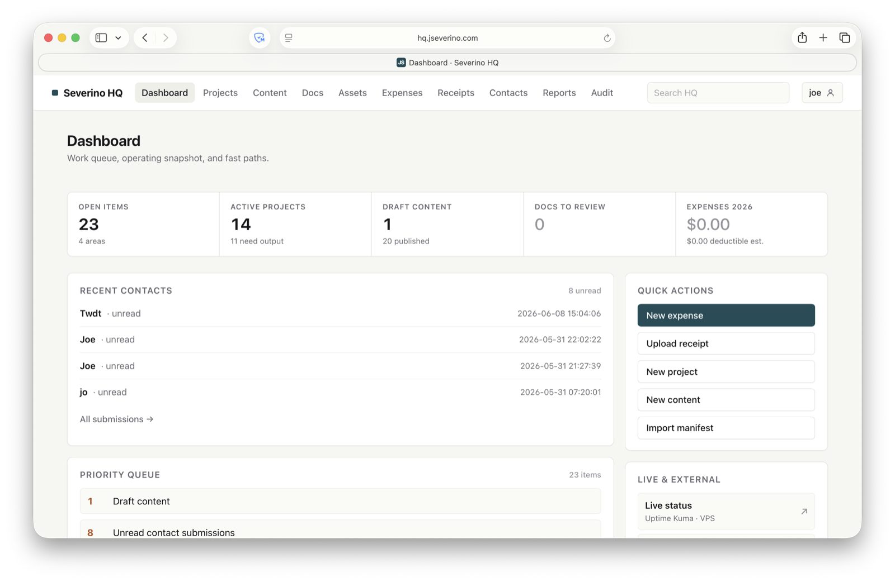
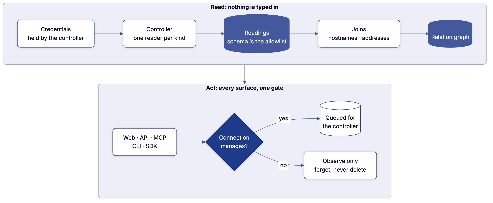
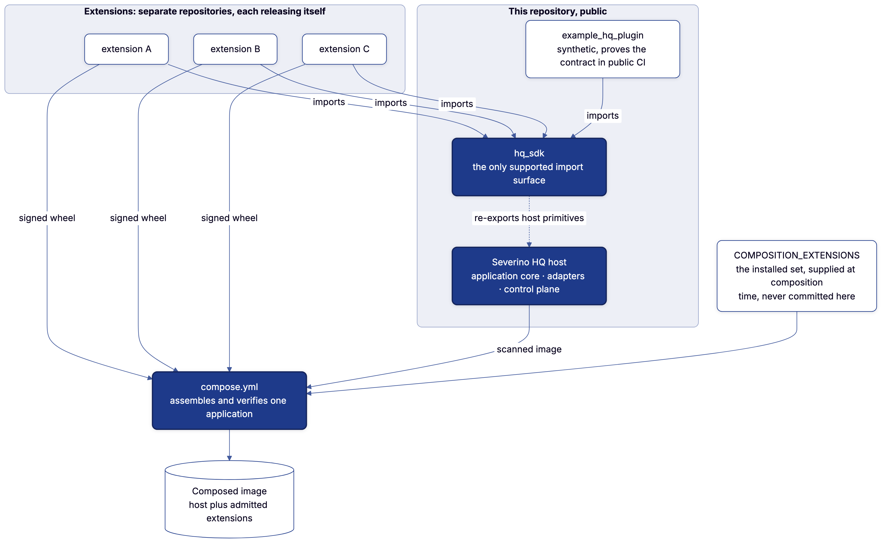
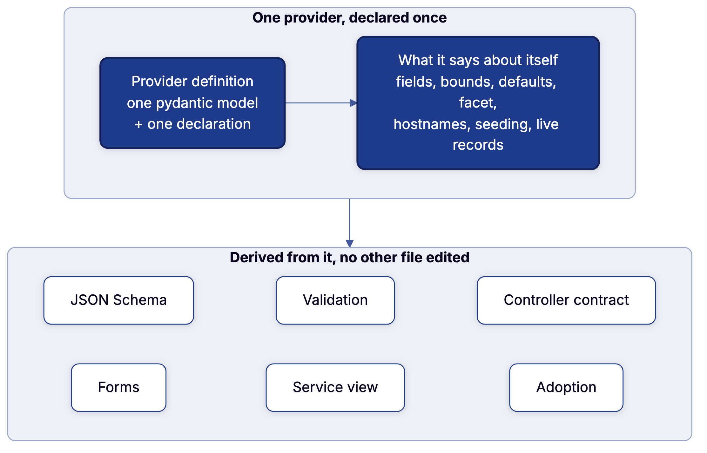
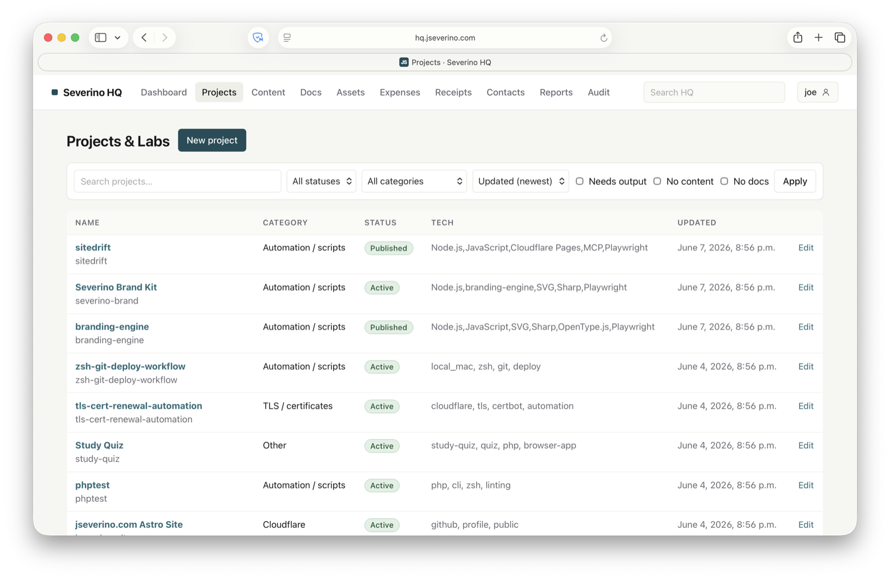
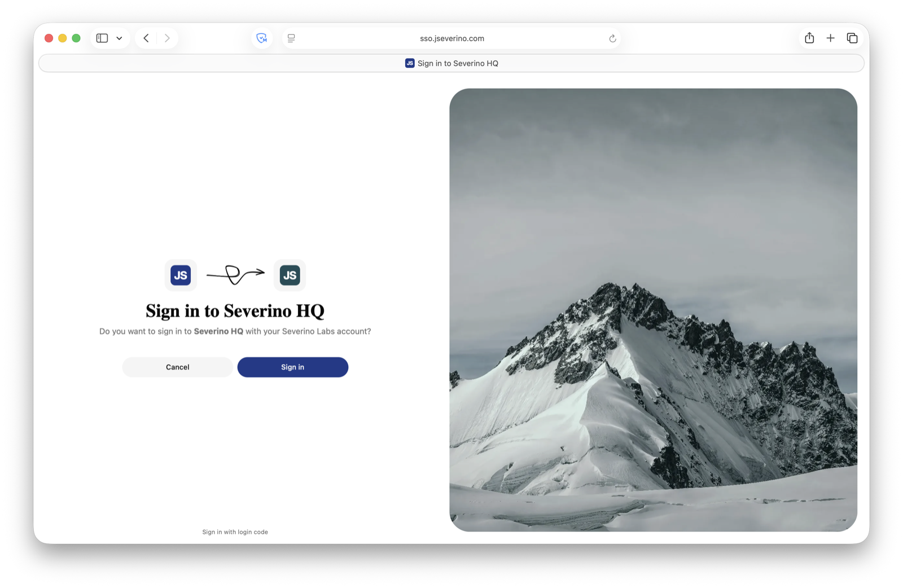
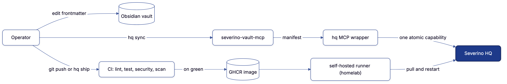

# Severino HQ

[](https://github.com/joeseverino/severino-hq/actions/workflows/ci.yml)
&nbsp;
&nbsp;

A self-hosted operations hub that derives its picture of your infrastructure
from the credentials you give it. Connect a Cloudflare token and a Tailscale
credential, and machines, services, domains and the relationships between them
are read, joined and kept current. Every change goes through one gated path that
the web UI, the API, MCP, the CLI and the SDK all share.

HQ is also a host: private extensions add whole domains to it, and this
repository names none of them. It holds the contracts they meet at, which is
why it can be public while they are not.



Severino HQ connects projects/labs, content ideas, documentation index records,
assets, expenses, receipts, basic reports, and AI-readable exports, so a
single source of truth links a router purchase to the expense, the receipt,
the project it powers, the article it inspired, the runbook that documents it,
and the year-end summary it rolls up into.

It is **not** a public website, a SaaS product, a CRM, or an accounting
system. It runs on a home server or a small VPS, reachable only over Tailscale.

## Derived, not authored

Nothing about the infrastructure is typed into a file. A controller holds the
credentials and reads what each one can see; HQ stores those readings, joins
them, and derives the rest.

- **Readings.** Each kind (a DNS record, a tailnet device, an Access
  application, a registration) is declared once in
  [`hq/domains/control_plane/observations/`](hq/domains/control_plane/observations/). Its schema is
  the allowlist for what is stored, and a refused read says which permission
  would allow it.
- **Joins.** Readings are matched to machines, services and domains by
  hostname and address, into one relation graph. The machine, service and
  domain pages, the topology, search and the dashboard all read that graph, so
  they cannot disagree.
- **Derived facts.** A machine's roles (exit node, tailnet DNS), its own LAN
  and public addresses, where HQ itself runs, and which actions a resource
  offers all follow from what was read.
- **Writes.** A record is adopted, reconciled, renewed or removed only through
  a connection that declares `manages`. HQ enforces that on every write path,
  and the controller enforces it again.



<sup>Diagram source: [`docs/diagrams/derived-estate.mmd`](docs/diagrams/derived-estate.mmd),
pre-rendered with [`diagram`](https://github.com/joeseverino/tools/blob/main/bin/diagram).</sup>

Onboarding is the connections page: it shows what each credential can see,
and [`scripts/`](scripts/) mints least-privilege Cloudflare and Tailscale
credentials for it. The design is written up in
[`docs/DERIVED_FACTS.md`](docs/DERIVED_FACTS.md).

## From knowing to doing

A reading is not finished when it is correct. It is finished when it says what
it means, how old its evidence is, what to do next, and whether that worked. The
same context and capabilities serve the browser and an AI assistant, so a
workflow can move between them without acquiring different rules.

A service, for example, ties its hostname to DNS, ingress, certificate, and
machine. A finding leads from that dependency evidence to an authorized remedy,
then to verification from fresh facts. HQ derives those connections from the
operational records it already keeps, rather than asking the operator to
maintain another diagram.

For a code review, start with the [application boundary](docs/APPLICATION_ARCHITECTURE.md),
the [extension contract](docs/PLUGINS.md), and the
[local verification gates](mise.toml). The public tests compose synthetic
extensions so the design can be inspected without access to the private installation.

## The host does not know its extensions

The domains HQ runs ship as separately released, signed packages from their own
repositories. This repository names none of them: no inventory, no repository
identifiers, no routes, no models, no vocabulary.

That is an architectural rule before it is a privacy one. A host that names an
extension has taken a dependency on it, and three properties stop holding: add
an extension without touching the host, run the host with none installed,
release the two on independent schedules.

The boundary is enforced in both directions. `python -m hq_sdk.validation`
rejects an extension importing anything but `hq_sdk`, against a package list
derived from the host tree rather than hand-maintained, so it cannot fall behind
as the host grows. Two contract tests check the reverse (that no host file
names an installed extension) taking the names from runtime composition rather
than from anything committed, since a list of them here would be the coupling
they look for. Public examples use the synthetic `example.*` namespace, which
lets the contract be demonstrated in public CI without the host gaining a real
consumer.



<sup>Diagram source: [`docs/diagrams/host-and-extensions.mmd`](docs/diagrams/host-and-extensions.mmd),
pre-rendered with [`diagram`](https://github.com/joeseverino/tools/blob/main/bin/diagram).</sup>

How that assembly is triggered, fingerprinted and deployed is under
[How changes reach HQ](#how-changes-reach-hq); the contract an extension
implements is [`docs/PLUGINS.md`](docs/PLUGINS.md).

---

## Stack

- Django 6.1 + SQLite (PostgreSQL is a future option)
- Django templates, server-rendered; JavaScript progressively enhances
- Plain CSS (no build step, no CDN runtime dependencies)
- Django auth, Django ORM and migrations
- Environment variables for secrets

## One application core, every interface

The web UI, the HTTP API, MCP, the management CLI and the extension SDK share
the same application services.
Adapters parse and render; `hq/platform/application/` owns validation, transactions,
persistence, audit attribution, and canonical results. The reference project
slice and documentation sync mutation are described in
[`docs/APPLICATION_ARCHITECTURE.md`](docs/APPLICATION_ARCHITECTURE.md).
Trusted, installable modules use the domain-neutral, versioned
[`plugin contract`](docs/PLUGINS.md); a generic conformance plugin proves the
contract in public CI without coupling HQ to any private module.

Infrastructure follows the same rule, and HQ is both halves of it: it derives
what exists from what its credentials reach and what its sweeps find, and it
authors what should be configured. The controller reconciles only explicitly
enabled capabilities, reports back both observed state and the full provider inventory,
and holds every provider credential: those never enter HQ persistence or the
web process.

Because the controller reports everything a provider holds rather than only the
records HQ created, HQ can show what it does not manage and adopt it, capturing
the live settings verbatim so the first reconciliation after adopting changes
nothing.

HQ also derives one actionable topology from those same contracts: controllers
carry connections, connections enable abilities and reach targets, and abilities
govern declared resources. The web explorer, HTTP API, and MCP expose the same
normalized graph; its actions invoke the existing application capabilities, so
there is no second source of truth or graph-only mutation path.
Any node can be traced inbound or outbound through a bounded number of hops,
turning that same projection into dependency and blast-radius answers before an
operator or agent invokes one of those actions.


<sup>Diagram source: [`docs/diagrams/infrastructure-control-plane.mmd`](docs/diagrams/infrastructure-control-plane.mmd),
pre-rendered with [`diagram`](https://github.com/joeseverino/tools/blob/main/bin/diagram).</sup>

A provider is declared once, as a pydantic model plus a short statement of how
it participates. Its schema, its validation, the controller's contract, the
generated create-and-edit forms, the service view, and adoption are all derived
from that one declaration.



<sup>Diagram source: [`docs/diagrams/provider-registry.mmd`](docs/diagrams/provider-registry.mmd),
pre-rendered with [`diagram`](https://github.com/joeseverino/tools/blob/main/bin/diagram).</sup>

## Modules

1. Dashboard: KPIs, needs-attention queue, quick actions, relationship
   health, recent activity, docs needing review.
2. Projects / Labs: CRUD with category/status, technologies, repo & public URLs.
3. Content Pipeline: CRUD with type, status, WordPress IDs, related records.
4. Documentation Index: metadata + relationships only; Obsidian stays the source of truth.
5. Assets / Equipment: purchase data + auto-computed estimated deductible.
6. Expenses: categorized line items + auto-computed estimated deductible.
7. Receipts: uploaded outside app code, served only via auth-protected view.
8. Reports / Exports: KPI page + CSV exports + year-summary JSON & Markdown.
9. Audit Log: every important create/update/delete/login/upload/export.
10. Services: every hostname, and whether its DNS, ingress and certificate are
    in place, composed from the resources behind it rather than stored.
11. Infrastructure: desired state HQ authors and edits, what the providers
    actually hold, adoption of what they hold and HQ does not, drift,
    certificate issuance and installation, and audited reconciliation.
12. MCP-ready: stable IDs/slugs, JSON exports with relationships, AI-readable Markdown.

---

## Operator UI

The app is intentionally dense and practical: list pages stay table-first, the
dashboard surfaces work that needs attention, and global search is always
available in the header.

- The top navigation highlights the active section and stays on one row on
  desktop. If the viewport is narrow, the nav scrolls horizontally instead of
  wrapping into stacked links.
- Operator utilities (Action items, Sign out) sit in a dropdown under
  your username, keeping the domain nav compact. When anything is unread, its
  count sits beside your username. It is fetched after the page renders, so no
  page assembles the queue just to draw the header.
- Header search and <kbd>Ctrl/⌘ K</kbd> open Command Center. It searches
  destinations, records, devices, content, connections, and authorized
  commands; Enter opens the selected result or the complete `/search/` result
  set.
- `/action-items/` is the complete cross-domain queue. The dashboard is its
  compact preview; host domains and installed extensions emit the same Insight
  contract, and derived infrastructure findings link through to their evidence
  and safe existing remedies. An Insight may carry quick actions, posted to
  their owner's route; a held approval uses them for Approve and Reject.
- Items can be marked read, per person. A read item is unread again once it
  changes: its count, detail or status.
- Headline metrics lead the dashboard, grouped by their runtime contributor,
  with a compact attention preview in the utility rail. Contributors with several readings
  get a compact overview; their existing typed summary supplies its reporting
  window and optional chart and calendar, visible without expanding a panel. Single readings stay in
  the shared metric strip. No installed domain names are encoded in the layout.
  The full queue retains each entry's severity, recommended next step, and any
  supplied resolution workflow. Snapshot ages remain visible on mobile, and
  readings at least an hour old are marked out of date.
- Dashboard at-a-glance readings are refreshed by a POST, from the refresh
  button or from the dashboard opening on a reading over five minutes old;
  viewing them never requests one. They are timestamped and owned by their
  source records. Host telemetry belongs to the selected machine
  declaration; weather belongs to the configured NWS point. The page does not
  continuously poll either provider.
- Relationship health counts are status indicators, not blockers; non-zero
  values mean there is link or metadata cleanup worth doing.

Table-first list pages keep the relational data dense and scannable:



Sign-in is OIDC SSO against a self-hosted **Pocket ID** (Tailscale-only,
passkey-first). With SSO on, password sign-in is off; an operator with host
access can turn it back on (`SEVERINO_PASSWORD_LOGIN_ENABLED`) as a break-glass
path:



---

## How changes reach HQ

Every operator action lands through a *checked* path: content through a shared
schema, code through a gated pipeline. The Obsidian vault stays the source of
truth; only validated metadata and tested images ever reach HQ.



<sup>Diagram source: [`docs/diagrams/changes-reach-hq.mmd`](docs/diagrams/changes-reach-hq.mmd),
pre-rendered with [`diagram`](https://github.com/joeseverino/tools/blob/main/bin/diagram).</sup>

**Content: `hq sync`.** Severino HQ never reads the vault directly. The
[`hq`](https://github.com/joeseverino/tools) CLI calls the local
[`severino-vault-mcp`](https://github.com/joeseverino/severino-vault-mcp)
server to emit one JSON manifest, then sends it to HQ through one authenticated
`hq.sync` MCP capability call. HQ validates and commits it atomically, with no SSH,
temporary server payload, or partial sync. The
importer validates every record against
[`hq/domains/docs_index/schema.json`](hq/domains/docs_index/schema.json): the frontmatter enum
contract single-sourced from the MCP and committed here, so HQ can never accept
a value the MCP wouldn't emit, and vice-versa. Records upsert by `doc_id`;
runbook bodies and secrets never enter HQ.

**Code: `git push` / [`hq ship`](https://github.com/joeseverino/tools).** Every
workflow is started by an event. **CI**
([`.github/workflows/ci.yml`](.github/workflows/ci.yml)) runs on every pull
request and push: Checks (lint, types, lockfiles, workflows, shell, a
`check --deploy` posture gate, `pip-audit`, dependency review, the structural
bar and Scorecard), Tests on Python 3.13/3.14, Browser, Controller (the Go
controller's own gate), and Image (a
production image that must boot healthy and pass Trivy, then published and
signed), and **Ready**, which writes HQ's review, the one required check. Each
job runs the aggregate of its name from [`mise.toml`](mise.toml), where every
gate is declared once, so `mise run ci` runs the same gates before a push. **CodeQL** runs GitHub's code
scanning beside it. **Compose**
([`.github/workflows/compose.yml`](.github/workflows/compose.yml)) builds HQ
itself: that host with every admitted extension, verified as one application.
**Deploy** ([`.github/workflows/deploy.yml`](.github/workflows/deploy.yml))
runs only for `main`: it waits for a person's approval, then a **self-hosted
runner on the homelab** deploys the signed composition with health rollback.
The runner dials out to GitHub, so nothing inbound is ever opened, and a pull
request never reaches it.

Extensions verify and admit themselves in their own repositories and publish
signed bundles; they never build or deploy an image. An admission starts the
composition itself, through HQ's GitHub App, so an extension release reaches
production with nothing polling for it. HQ's app says on every change where it
stands (**Severino HQ · Review** on a pull request, **Severino HQ ·
Production** on `main`) and, when something fails, why and what fixes it. See
[`docs/DEPLOYMENT.md`](docs/DEPLOYMENT.md) and
[`docs/PLUGINS.md`](docs/PLUGINS.md#composition).

---

## Local development

Coding agents and contributors should read [`AGENTS.md`](AGENTS.md) first. It
contains the one-page architecture map, placement rules, the host/extension
boundary, frontend standards, and definition of done.

### Set up and run

Install [mise](https://mise.jdx.dev) first. It needs a `python3` on the PATH
to read the uv pin from `pyproject.toml`.

```bash
# 1. Clone & enter
git clone <your-mirror> severino-hq
cd severino-hq

# 2. The pinned tools (versions in mise.toml, checksums in mise.lock), and uv.
#    Any uv works: uv.lock decides every package it installs.
mise install

# 3. Environment
cp .env.example .env
# (for dev you can leave DEBUG=0 with a real SECRET_KEY, or set DEBUG=1)

# 4. DB + first user
uv run --locked python manage.py migrate
uv run --locked python manage.py createsuperuser

# 5. Optional demo data
uv run --locked python manage.py seed_demo

# 6. Run the production-like ASGI dev server (binds to localhost only)
mise run dev
```

Python dependencies come from `uv.lock` through `uv run --locked`, which every
task uses; no virtualenv is made by hand. The image alone still bootstraps uv
itself ([`Dockerfile`](Dockerfile)).

Open <http://127.0.0.1:8000/>, sign in.

`mise run dev` collects versioned assets, then runs Uvicorn with reload enabled.
Using the same ASGI path as production means local browser checks exercise
compression, cache headers, and routing instead of Django `runserver`'s
development-only static handler.

### The gates

After setup, the entire local quality gate is one command:

```bash
mise run check
```

and everything the pipeline will check is one more:

```bash
mise run ci
```

Whether a change is ready to release is one command whose exit 0 means ready:

```bash
mise run preflight
```

It runs every gate of `mise run ci`, then the composed suite with the extension
set required, then checks the deploy host read-only over SSH
(`SEVERINO_HQ_DEPLOY_HOST`).

Every gate is a task in [`mise.toml`](mise.toml) named `<job>:<gate>`, and each
CI job runs the aggregate of its name, so the list exists once. `mise tasks`
prints it, `mise run checks:ruff` runs one gate, and `mise run -c ci` keeps
going past a failure and names every gate that failed. `mise run fast` is the
inner loop: only what the change touches.

`mise run ci` includes the code scanning gates: CodeQL with the suite
`codeql.yml` runs and OpenSSF Scorecard's file-based checks, at the versions
`mise.toml` pins and `mise.lock` verifies, so an alert is reported here before
a push.

Every task reads an optional, gitignored `mise.local.toml` for the things only
your machine knows: where the extensions' sources are and which to enable. Copy
[`scripts/mise.local.example.toml`](scripts/mise.local.example.toml) to
`mise.local.toml` in the repository root and fill it in. Without it the
commands still run, but cover less: `mise run check` says the composed pass did
not run, and that pass is the one that catches what public CI cannot, because
the host and its extensions first meet there.

`uv sync` manages a dedicated host environment exactly. Do not run it on an
assembled environment containing extension wheels: it can remove packages the
host lock does not name. For those environments, export runtime dependencies
with `uv export --locked --no-default-groups --no-emit-project` and install the
hashed export additively. The local gates need no such environment: the
composed suite imports the extensions' sources through `PYTHONPATH`.

The [repository layout guide](docs/REPOSITORY_LAYOUT.md) explains the package
roots, stable database identities and local runtime paths. Existing local databases
require an explicit path choice; the layout move does not move their data.

### What the gates need

`mise install` supplies the pinned tools and `uv run --locked` the Python
dependencies (uv itself is the one prerequisite besides mise), the `browser` and `audit` groups included when a gate asks for
them. `mise run ci` covers what CI runs, so it also needs what CI's runner has.
Tool versions are pinned in [`mise.toml`](mise.toml) with their checksums in
[`mise.lock`](mise.lock), Python packages in `uv.lock`;
[`scripts/toolchain.env`](scripts/toolchain.env) holds the facts that are not
tools (the Python matrix, the coverage floor, the runner image). The list below
says what mise does not supply, never which version, so it cannot drift from the
pins.

- **An unprivileged account.** Run the gates as yourself, not as root. The
  systemd unit contracts model the deploy host's runner with the current
  account, and the host refuses a runner that is root, so the contract test
  does too.
- **A checkout that account can write.** The readiness probe's tests require
  `var/` and configured runtime volume paths to be writable and fail with a bare 503
  when they are not; `.mypy_cache/` has the same need. A tree once touched as
  root needs its ownership fixed first.
- **Every supported Python** (`PYTHON_VERSIONS`). `mise run tests` walks the
  list, each version in its own environment (`.venv-<version>`), with uv
  supplying the interpreter. CI runs the matrix, so a version-specific failure
  is otherwise found by pushing.
- **System tools:** `python3`, with which mise reads the uv pin; Go at the
  version `controller/go.mod` names, for the controller gate; and `ssh-keygen`,
  `sqlite3` and `zstd`, which the shell suites call.
- **Network, the first time:** mise downloads the tools, CodeQL and Scorecard
  among them, and verifies each against `mise.lock`. Scorecard's vulnerability
  check queries `api.osv.dev` on every run, so behind a proxy that refuses it,
  that one check fails while the rest still report.
- **A container runtime** for the image build and the suite inside the image.
  Without one the `image` gates fail. CodeQL wants about 2 GB of memory.
- **`DJANGO_SECRET_KEY`, or `DJANGO_DEBUG=1`,** for a command run outside a
  task. With debug off, settings refuse to load without a key, even for a
  one-line import check. Each task sets its own.

### Browser layout checks

Browser layout regressions are a gate of their own. CI runs them in the
Browser job and `mise run ci` always does; `mise run check` leaves them out.
Playwright is a development dependency, pinned by hash and never installed in
the image:

```bash
mise run browser
```

The task installs the Chromium the locked Playwright pins, then runs
`hq.platform.core.browser_tests` on one process.

The suite renders the dashboard, service, connections, machine, topology and
project list pages through their real views over a synthetic `example.*`
estate, then loads them with every request answered in process. At 320, 390,
768 and 1280px it checks that stylesheets load, nothing escapes the page
sideways (with disclosures open too), tables scroll inside their own container
rather than stacking, stretched grid rows end together, siblings never overlap,
and the structural rules of `scripts/layout-audit.js` hold. At 375, 820 and
1360px it checks that only a `.table-scroll` scrolls sideways and that nothing
runs out of its table cell. JavaScript is disabled to protect the
server-rendered baseline. Failures save a synthetic screenshot to an OS
temporary directory. `hq/platform/core/tests/test_browser_selectors.py`, in the normal suite, fails when a selector the gate or the audit uses names
nothing a template renders, so a redesign cannot leave the gate waiting for an
element that no longer exists.
Set `HQ_BROWSER_ENGINE=webkit` or `firefox` after installing that engine to run
the same assertions there. An existing Edge installation can be selected with
`HQ_BROWSER_CHANNEL=msedge` instead of downloading Chromium. See the
[Playwright browser documentation](https://playwright.dev/python/docs/browsers).

### Django Debug Toolbar

The Django Debug Toolbar is a development layer, pinned by hash in
the `dev` dependency group and never installed in the image (`mise run ci` and CI's
Image job both prove the built image cannot import it). It is on only when
`DJANGO_DEBUG` is on, `SEVERINO_DEBUG_TOOLBAR=1` is set, the package is
importable, and the suite is not running:

```bash
SEVERINO_DEBUG_TOOLBAR=1 mise run dev
```

It shows to loopback clients; behind a proxy, name the proxy's address in
`SEVERINO_DEBUG_TOOLBAR_IPS` (comma separated). The toolbar's scripts carry the
response's CSP nonce, so `script-src` stays as production sends it. Its panels
insert fetched HTML through `innerHTML`, which Trusted Types refuses, so while
it is on the two Trusted Types directives are dropped
(`hq/config/devtools.py`). Nothing else in the policy changes, and with the flag
off (always, in production) the policy is the full one.

### Importing a documentation manifest

Severino HQ does **not** read your Obsidian vault directly. Export a JSON
manifest from the vault (one entry per doc) and import it:

```bash
python manage.py import_docs_manifest path/to/docs_manifest.json
```

Or upload the file through the UI at **Docs → Import manifest**. See
`hq/domains/docs_index/importer.py` for the schema.

---

## Production deployment

Severino HQ runs **homelab / small VPS, reachable only over Tailscale**: the app
binds to localhost (or the Tailscale interface), a reverse proxy terminates TLS,
and the public internet never sees it.

Day to day it deploys through the gated pipeline in
[How changes reach HQ](#how-changes-reach-hq): a push to `main` ships a
Trivy-scanned image that a self-hosted homelab runner pulls and restarts.
[`docs/DEPLOYMENT.md`](docs/DEPLOYMENT.md) has the from-scratch recipes:
containerized (Docker Compose with named volumes for SQLite / receipts /
exports, optional Tailscale sidecar) and systemd + Caddy/Nginx on a VPS.

See [`docs/SECURITY.md`](docs/SECURITY.md) for the production security checklist
and [`docs/BACKUP.md`](docs/BACKUP.md) for SQLite-safe backup & restore
(`VACUUM INTO` + `age` / `restic`). The roadmap (clients, invoices, the
WordPress bridge, Postgres migration) is in
[`docs/ROADMAP.md`](docs/ROADMAP.md).
