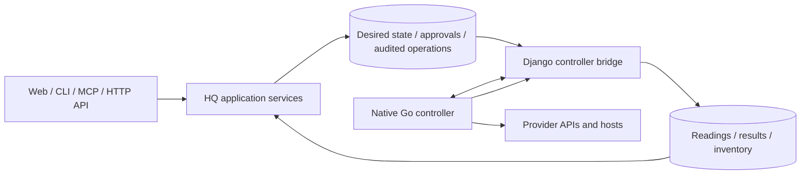

# HQ controller

The native Go controller executes queued infrastructure operations and reports
provider readings through HQ's Django bridge. HQ owns desired state,
authorization, approvals, operation records and inventory admission. The
controller owns provider transport and credentials; credentials do not enter
HQ persistence or the web process.

The bridge is HTTP on a Unix socket HQ's running process serves, described by
`api/hq-controller.openapi.json`. `runtime/bridge.gen.go` is the client and the
message types generated from it; `runtime/bridge.go` adds the deadline, the
size bound and the strict decoding, and `runtime/bridge_socket.go` dials only a
socket this account can trust: its own, mode 0600, in its own private
directory, answered by its own uid. `SEVERINO_BRIDGE_SOCKET` names the path. No
process is started to reach HQ, and a bridge that is not there fails the pass.

`cmd/hq-controller` is a one-shot process. Without `--apply` it produces a
preflight plan; `--apply` claims and executes queued operations. Reconciliation
requires a connection that declares the relevant `manages` capability. Named
connections must belong to the requested provider.

`hq-controller job NAME` asks HQ for one piece of scheduled work over the same
socket and exits as the job ended. A timer runs it inside the web container;
it loads no connection and links into no provider call.

`cmd/hq-secrets` is a separate binary: the renderer root runs on the host to
read the vault through 1Password Connect and install what the consumers read
(`docs/SECRETS.md`). It links no provider code. Connections reach the
controller in one document whose type both sides share (`connections/`),
mounted read-only and named by `HQ_CONTROLLER_CONNECTIONS`; none is an
environment variable of the container.

Provider wire payloads use generated vendor models or official client types.
Malformed payloads fail explicitly. Typed errors become contract failure classes
at the reporting boundary. Provider declarations and the emitted controller
OpenAPI document supply the shared vocabulary.

Run `mise run controller` from the repository root (it runs
`controller/scripts/check.sh`) and `go test -race ./...` from `controller/`.
Generated contracts and vendor slices must regenerate without a diff. The full
repository gate is `mise run check`.

The Go worker replaces the Python worker in this change. Captured parity runs
are historical migration evidence; the Python worker, coercion helpers and
parity harness are removed. There is no compatibility layer or permanent
cross-language parity requirement.

Deployment validation remains separate: a real image build and smoke check,
approved read-only production constraint checks, and an approved edge shadow
comparison of create/change/leave plans remain outstanding. Do not describe the
local test results as deployment approval.

