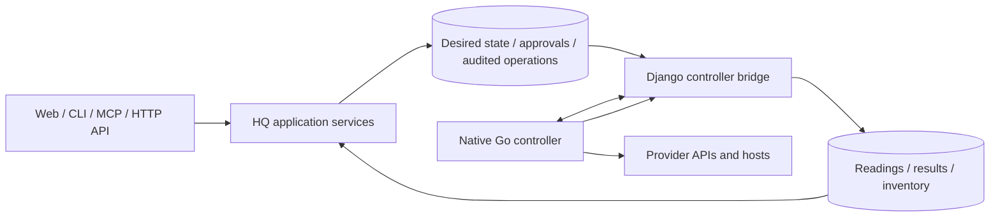

# HQ controller

The native Go controller executes queued infrastructure operations and reports
provider readings through HQ's Django bridge. HQ owns desired state,
authorization, approvals, operation records and inventory admission. The
controller owns provider transport and credentials; credentials do not enter
HQ persistence or the web process.

`cmd/hq-controller` is a one-shot process. Without `--apply` it produces a
preflight plan; `--apply` claims and executes queued operations. Reconciliation
requires a connection that declares the relevant `manages` capability. Named
connections must belong to the requested provider.

Provider wire payloads use generated vendor models or official client types.
Malformed payloads fail explicitly. Typed errors become contract failure classes
at the reporting boundary. Provider declarations and the emitted controller
OpenAPI document supply the shared vocabulary.

Run `bash controller/scripts/check.sh` from the repository root and
`go test -race ./...` from `controller/`. Generated contracts and vendor slices
must regenerate without a diff. The full repository gate is `scripts/check.sh`.

The Go worker replaces the Python worker in this change. Captured parity runs
are historical migration evidence; the Python worker, coercion helpers and
parity harness are removed. There is no compatibility layer or permanent
cross-language parity requirement.

Deployment validation remains separate: a real image build and smoke check,
approved read-only production constraint checks, and an approved edge shadow
comparison of create/change/leave plans remain outstanding. Do not describe the
local test results as deployment approval.

