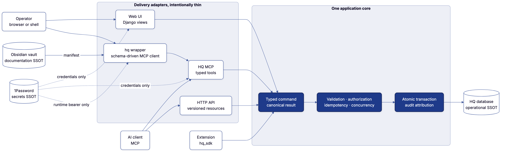
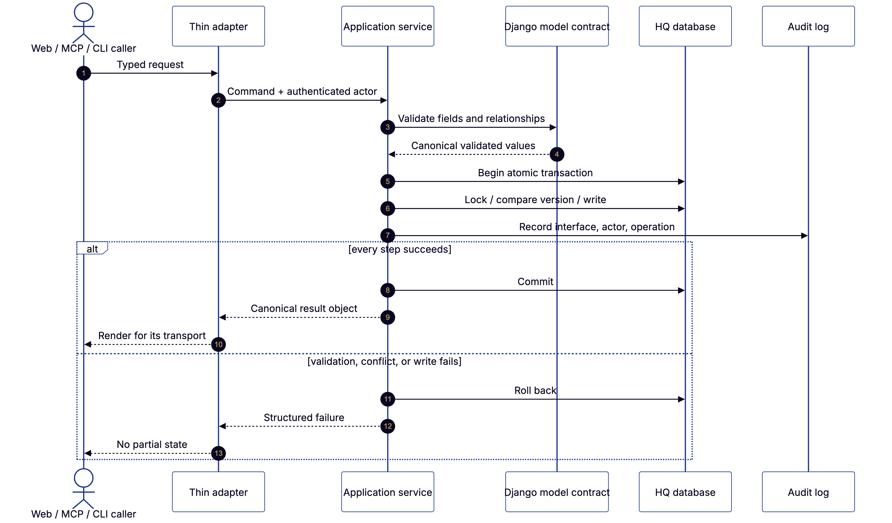
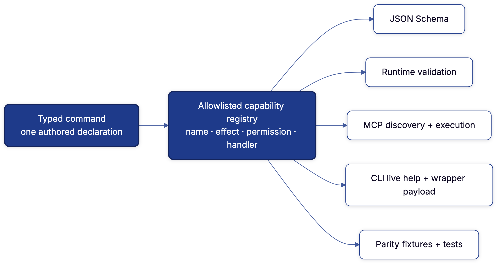
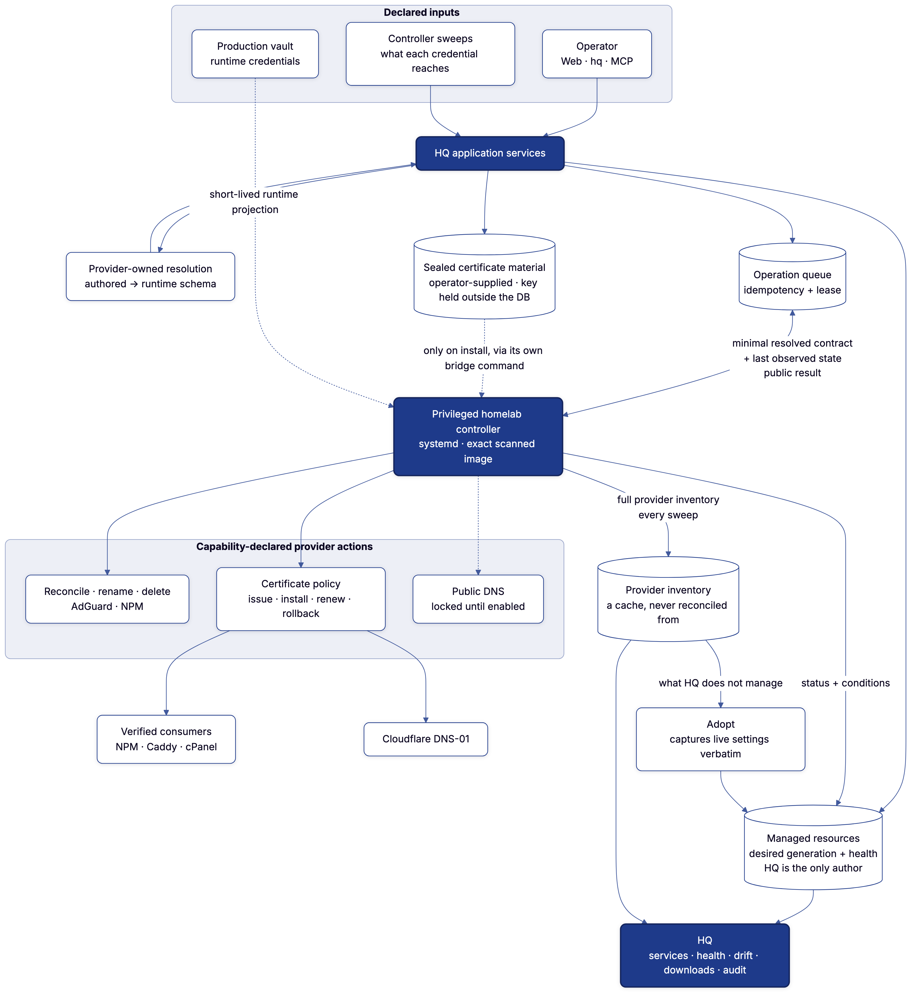

# One HQ brain, every interface

Severino HQ presents three faces: a fast operator web UI, typed MCP tools for
agents, and a dependable CLI for shell workflows and recovery. They are not
three implementations. They are three adapters over one application core.



<sup>Diagram source:
[`application-core.mmd`](diagrams/application-core.mmd), rendered with the
canonical [`diagram`](https://github.com/joeseverino/tools/tree/main/bin/diagram)
tool.</sup>

## The boundary

The `application/` package is HQ's behavior boundary. It owns everything that
must remain identical no matter who initiated an operation:

| Concern | Canonical owner |
|---|---|
| Request shape | Typed application command |
| Field and relationship validity | Application service + Django model contract |
| Authorization policy | Application service |
| Idempotency and stale-write protection | Application service |
| Transaction and locking boundary | Application service |
| Persistence | Django ORM inside that transaction |
| Actor and interface attribution | Shared audit context |
| Returned data | Canonical result object |
| HTML, MCP JSON, terminal prose | Delivery adapter only |

A Django view may translate a form. An MCP tool may translate typed arguments.
The `hq` wrapper may translate ergonomic flags into the advertised JSON Schema.
None may decide what a valid HQ mutation means or write around the service.

## One operation, end to end



<sup>Diagram source:
[`operation-lifecycle.mmd`](diagrams/operation-lifecycle.mmd).</sup>

The same lifecycle applies to a browser submit, MCP tool call, or CLI command.
The adapter disappears after parsing. The application service validates,
authorizes, opens the transaction, protects against stale state, writes, audits,
and returns one stable result. The adapter only chooses how that result looks.

That boundary includes reads. `application.resources.ResourceSpec` is the
registry of readable domains; canonical query projections live in their
application services and in `application/read_models.py`. Web, API, MCP, and
CLI adapters may filter or render those results, but they do not import Django
models or rebuild result shapes.
The projections opt into Django 6.1's `FETCH_RAISE` mode after declaring their
`select_related()` plans. An omitted relationship therefore fails at the
projection boundary instead of silently becoming an N+1 query in production.
An architecture fitness test rejects direct model access from the MCP service
adapter so this separation cannot silently regress.

The dashboard follows the same contract. `application/dashboard.py` emits one
JSON-safe operating snapshot for KPIs, priority work, recent records, upstream
state, and activity. The web dashboard renders it, while the authenticated MCP
exposes it as `dashboard_snapshot`. Infrastructure reads are likewise shared:
`list_managed_resources` and `get_managed_resource` return public desired state,
health, and structured operation evidence without provider credentials. A
future REST/OpenAPI adapter can publish these same use cases without moving or
reimplementing their behavior.

The page-head glance is also a projection, never an owner. Whole-host CPU,
memory, and storage observations are stored under the selected machine
resource's observed `status.telemetry`, so its machine page, resource API, and
dashboard summarize the same timestamped fact. The operator selects that owner
with “Show on dashboard” on the machine edit form; the relationship lives in
`DashboardConfiguration`, not in deployment environment or desired machine
state. NWS data is separately owned by the dashboard-configured point's
`WeatherObservation`; its coordinates and labels are edited in the dashboard
Settings popover. Both are cold until an operator
requests a refresh: HQ records a credential-free `DashboardRefreshRequest`,
rings the existing controller doorbell, and the responsible controller derives
its target and connection from the machine graph. The browser follows that one
request for a bounded interval; it never installs a page-lifetime polling loop.
An SSH-capable connection yields whole-host readings. A Portainer fallback is
explicitly labeled as container and Docker scope rather than being presented as
machine utilization.

Priority work has one source: every domain's `Insight` provider is composed by
`domain_attention_items()`. The dashboard preview, `/action-items/`, and the
machine snapshot project that same queue; none owns a parallel inbox. Derived
topology findings enter through the infrastructure provider and drill into an
evidence/remedy surface, where remedies remain references to registered
capabilities rather than a second mutation path.

Higher-order findings preserve the same rule. Exact resource and kind facts
remain addressable, while the default projection follows topology edges to
group downstream symptoms under a proven shared controller. The frontend then
renders the subject's already-authorized actions as “what HQ can do now”; it
does not maintain a parallel action catalog. Focus and dependency-trace links
are application-level actions too: findings, topology, connection views, and
machine adapters all receive one canonical topology address rather than
reconstructing query strings. A stale-controller finding also derives the
registered controller-refresh capability from that same node. Executing it
rings the existing credential-free doorbell; the privileged controller still
pulls work and decides what is due, so a natural remediation loop does not
reverse the trust direction or create a second scheduler. Contextual command
links carry a same-origin return path through Command Center's result screen,
so execution stays on the canonical command spine without losing the workflow
that proposed it. The resolution-plan primitive itself is domain-neutral and
exported through `hq_sdk.workflows`: a domain emits a stable claim, supporting
actions, authorized remedies, and its own verification action; HQ derives the
ordered understand → act → verify projection and the machine-readable
`claim_absent` completion condition. Infrastructure is merely its first
producer. Analytics freshness follows the
same shape: successful site-day coverage is a fact, HQ derives missing windows,
and the controller executes that plan without owning a second backfill policy.

Large projections run inside `application.projection.projection_scope()`. A
reading may be reused while one answer is assembled and is discarded when that
scope exits, eliminating repeated joins/counts without serving process-cached
state to a later request. The dashboard's contact rows, unread total, and
upstream health likewise arrive from one D1 request.

The dashboard projection has an executable query budget. Growth that adds an
unbounded query or N+1 relationship fetch fails CI before it becomes an
operator-visible latency regression.

This is the important scaling property: a fourth interface does not create a
fourth implementation.

## Search and table reads

`application.search` is the search boundary for web tables, CLI/TUI clients,
and future MCP tools. It accepts a named scope and query and returns stable
domain identifiers; adapters do not know how text is indexed.

Every entry point requires a `Principal`. Ordinary scopes need the baseline
`READ` capability; the `audit` scope needs `READ_AUDIT_LOG`, which
least-privilege adapter principals (MCP) do not hold — free-text search over
the security log is an operator-only capability. A new adapter therefore
cannot expose search without deciding whose authority it acts under.

`global_search` is the cross-scope use case behind the `/search/` page:
relevance-ranked hits per scope with FTS5 `snippet()` match extracts,
returned as structured `(text, is_match)` parts so each renderer escapes
content and applies markup independently. Presentation metadata (group label,
title field, badge, timestamp) lives on the `SearchDefinition` carried by its
`ResourceSpec`, so every surface labels a hit the same way. Scopes a principal
cannot search are omitted from the result, not rendered empty. Contact submissions live
in Cloudflare D1, not the local database, so the web view merges them as an
eighth group beside the registry scopes.

`search_index.SearchDocument` is a derived relational projection. On SQLite,
an FTS5 external-content table indexes that projection with Unicode tokenization
and 2/3/4-character prefix indexes. Database triggers keep the FTS structure
atomic with projection writes, while domain-model signals keep the projection
atomic with the authoritative record. A rollback therefore removes all three
changes together.

The backend is replaceable. A future PostgreSQL deployment can supply a native
search backend without changing table views, query parameters, CLI output, or
domain models. When an indexed backend is unavailable, the application service
retains a bounded ORM fallback.

Operational interfaces use the same contract:

```bash
python manage.py search_hq projects "certificate automation"
python manage.py rebuild_search_index
```

`application.tables.TableListMixin` composes indexed search with multi-value
filters, workflow toggles, allowlisted ordering, and database pagination. The
browser progressively enhances that GET contract with debounced, cancelable
requests; plain links and forms remain the complete fallback.

## Emit once, derive everywhere



<sup>Diagram source:
[`emit-once-capabilities.mmd`](diagrams/emit-once-capabilities.mmd).</sup>

HQ's allowlisted capability registry binds each typed command to one operation
name, effect, required permissions, and application handler. From that registry:

- `describe_capabilities` emits deterministic JSON Schemas for MCP clients;
- `execute_capability` validates a JSON object and returns one canonical
  success/error envelope;
- the authenticated Streamable HTTP MCP endpoint exposes that catalog and
  executor to the web-independent CLI and agents;
- the Command Center derives an authorized browser form and machine-contract
  view for every capability, including plugin capabilities, without a
  capability-specific view or template;
- management commands remain an in-process break-glass adapter over the same
  registry; and
- tests derive their contract assertions from the emitted schemas.

The generic executor is not generic database access. It can invoke only
allowlisted operations in the registry, and every operation still crosses the
typed principal, capability check, and application transaction.

Reads use the parallel `ResourceSpec` contract. One declaration states whether
a resource is searchable, listable, addressable, or any combination; binds its
required capabilities; and supplies a strict Pydantic query schema. The API and
MCP generic readers execute only registered handlers, while the search index
derives its core definitions from the same specs. Plugin resource names and
search scopes are collision-checked at composition startup, and handler
signatures are checked before the first request.

Managed infrastructure uses that same search projection. Provider and kind
names such as `tailscale` or `cloudflare` therefore return the locally stored,
clickable resources alongside the connection family that can reach them;
Command Center keystrokes never invoke a provider.

External access uses the third declarative registry, `ConnectionSpec`. It says
which family exists, what abilities and provider scopes it can carry, which
principal may inspect it, and how to read locally cached instances. Static
discovery never invokes instance providers; the Connections workspace and
machine list adapters do, after authorization. A plugin can therefore add an
integration without adding host templates or adapter registrations, while a
search keystroke can never trigger provider I/O. Runtime instances deliberately
have no secret field and relationship links are restricted to local or HTTP(S)
destinations. Endpoint metadata is display-only: URL userinfo, query strings,
and fragments are rejected both when controller inventory enters HQ and when a
plugin instance leaves its provider. The Connections security posture is a
query-free projection over that already-authorized catalog and the current
request; it does not perform a second sweep or claim to attest the external
router and firewall boundary that the process cannot observe.

The gateway that owns an endpoint owns this declaration. Host domains attach a
`connection_provider` to their `DomainDescriptor`; extensions attach the same
provider to `PluginManifest`. Adding a gateway therefore consists of one local
provider plus the capabilities/resources its abilities name, rather than edits
to the Connections page, Command Center, API, MCP, and topology separately.
Keyless services are connections too when they provide a real external boundary.
A provider emits cached/configured truth even when it currently has no token
(for example, public GitHub access), and status describes that reduced mode.
Supplying credentials upgrades the observation; it does not create a second
kind of integration.

The web Command Center is another projection of those three registries, not a
fourth inventory. Its resource links come from `ResourceSpec.web_route`, and a
`CapabilitySpec.subject_resource` connects each operation to the domain it acts
on. A matching `ConnectionAbility.subject_resource` plus `governs_kinds`
connects a searched external-system ability to the registered commands that can
act on those kinds; `ConnectionAbility.capability` names an exact command when
the operation is not resource-shaped. This is a registry join, not a command
invented from a credential scope: only a real typed handler can become
executable. Every permitted command links to one generic execution surface. The host
derives its controls from the canonical JSON Schema, rejects unknown and
repeated form fields, uses the registered operator-facing target label, and
derives eligible target choices through the authorized local `ResourceSpec`
query; opening a command never calls a provider. A zero-network browser preview
reflects the selected target and reason beside the registered handler, resource,
authority, effect, and execution notes, then invokes `execute_capability`; it
does not reimplement a handler. Retry keys are generated and hidden,
infrastructure/destructive effects require explicit confirmation, and
successful writes use POST/Redirect/GET. The same query
filters resources, commands, and connection families while global search
supplies live record hits. A plugin that contributes any spec appears in both
discovery and execution without a host edit. Cross-registry references and
reversible web routes are composition checks, not work repeated in an adapter.

The infrastructure Topology workspace is the relational projection of the
same declarations and observations. `ConnectionSpec` supplies abilities,
`ConnectionInstance` supplies observed targets and dependencies, controller
readings identify their observer, and `ManagedResource` supplies desired-state
nodes. One application function emits the normalized node-and-edge graph used
by web, HTTP API, and MCP. It stores no snapshot. Its actions point back to
canonical capabilities and web use cases, so manipulating a node still crosses
the existing authorization, validation, audit, transaction, policy, and retry
boundaries rather than editing a parallel graph.

The HTTP API and Command Center add durable retry semantics around that executor.
Every state-changing capability requires an actor-scoped idempotency key; the
canonical request hash and exact response commit in the same transaction as the
domain operation. A dropped response or process restart can therefore be
retried without repeating a non-idempotent plugin write. This adapter guard
does not replace domain idempotency, which continues to protect the same use
case when invoked through any interface.

## Source-of-truth map

"Single source of truth" is scoped by domain. Pretending one database owns
everything would make the system less honest, not more unified.

| Domain | Source of truth | What HQ stores |
|---|---|---|
| Authored documentation | Obsidian vault | Validated metadata, relationships, and vault pointers |
| Projects, assets, expenses, workflow state | HQ database | Authoritative operational records |
| Credentials and tokens | 1Password | Nothing secret, with one declared exception below |
| Which connections exist, what they permit, and what each reaches | Owning provider or 1Password/controller | A typed, timestamped `ConnectionInstance` — never the credential, never a second list |
| Mutation behavior | `application/` | The one executable business contract |
| Interface presentation | Web / MCP / `hq` wrapper | No business state |
| Which machines exist, and what reaches them | Sweeps, plus a declaration for what nothing sweeps | Derived first; declared only where nothing can observe |
| Desired infrastructure state | HQ database | The only copy |
| What a provider actually holds | The provider | A timestamped cache, never reconciled from |
| Provider authored/resolved contracts | Provider definition registry | No parallel resolver schema |
| Controller actions and automation | Validated controller capability document | Queued operations and observations |

The one exception to "nothing secret" is a certificate an operator generated
themselves and asked HQ to install. It is sealed with a key held outside the
database, refused outright when that key is absent, read only by the controller
through its own bridge command, and absent from every serializer. Provider
credentials remain outside the web container entirely.

The vault emits a validated manifest; HQ never walks the vault and never stores
Markdown bodies. The MCP does not become a database or a second rules engine.
It exposes the same application capabilities used in-process by HQ itself.

## Reference vertical slices

### Projects

`application.projects.save_project()` is the sole project create/update path.
The web create and edit views, MCP `create_project` / `update_project` tools,
and `create_project` management command all call it and receive the same
canonical representation.

Project writes provide:

- Django field and uniqueness validation;
- an atomic transaction;
- row locking for updates;
- optional `expected_updated_at` conflict detection;
- stable relationship-safe serialization; and
- audit metadata naming the interface, actor, and operation.

### Documentation synchronization

`application.sync.execute_hq_sync()` is the external synchronization boundary.
The local Vault MCP emits the manifest; `hq sync` sends it in one `hq.sync` MCP
capability call, applied inside one database transaction. It used to carry an
authored infrastructure topology alongside the manifest; HQ derives that now, so
the vault describes documentation and nothing else.

The sync is:

- atomic and safe to repeat;
- preflight-validated against the canonical frontmatter contract;
- bounded to 2,000 JSON-object records;
- incapable of importing Markdown bodies; and
- fail-closed for deletion: pruning requires `prune_orphans=true` and the
  separate `confirm_prune=true`.

### Assets

`application.assets.save_asset()` extends the same contract to equipment and
financial metadata. Web create/edit, MCP `create_asset` / `update_asset`, and
the `create_asset` management command share one transaction and result shape.
The service resolves project relationships before writing, rolls back on any
missing slug, normalizes deductible values through the model contract, and
supports the same optional stale-write protection as Projects.

### Content

`application.content.save_content()` owns the publishing pipeline record and
its Project, Asset, Expense, and Documentation relationships. All relationship
identifiers resolve before persistence, so one missing reference rolls the
entire operation back. MCP results omit sensitive and restricted documentation
identifiers while the authenticated web UI can still manage the underlying
relationship through the same service.

### Expenses

`application.expenses.save_expense()` owns financial record creation and
updates, deductible calculation, and its optional Project, Asset, Content, and
Documentation links. Related identifiers resolve before persistence, updates
lock the row, and MCP/CLI results share the same money-as-string representation
without disclosing sensitive documentation identifiers.

### Receipts

Receipt files and receipt metadata deliberately have different ingress paths.
Authenticated web upload calls `application.receipts.upload_receipt()` and the
shared file policy before private storage. JSON/MCP exposes only
`receipt.update`, which can change metadata and stable Expense/Asset links but
can never read, upload, replace, or return file bytes or a storage path. The
schema-derived capability therefore stays plug-and-play without turning the
MCP into a file-exfiltration surface.

### Documentation records

`application.documentation.save_documentation()` owns manual documentation
metadata creation and updates. It resolves all Project, Asset, and Expense
relationships before persistence and returns a sensitivity-aware canonical
representation. Restricted records remain manageable in the authenticated web
UI, while MCP and CLI results redact their vault, repository, URL, and notes
pointers.

### Deletes

`application.deletion` owns deletion for all six mutable HQ record families.
Every delete is an explicit registry capability with a `destructive` effect,
requires an exact target confirmation, locks the current row, optionally checks
`expected_updated_at`, and emits the normal attributed audit event. Receipt
storage cleanup runs only after the database transaction commits. MCP deletion
requires both ordinary writes and the separate delete switch; the CLI remains
an in-process recovery path.

## Security model

The service boundary complements the existing network boundary:

1. The MCP endpoint exists only on the tailnet.
2. `MCPBoundary` validates the direct peer, Host, Origin, and strong bearer
   token before tool dispatch.
3. Tools expose task-shaped capabilities, never generic SQL or arbitrary model
   mutation.
4. A typed `Principal` carries explicit capabilities into the application
   service; the service—not the adapter—authorizes the operation.
5. MCP starts read-only. `SEVERINO_MCP_ENABLE_WRITES` enables ordinary mutation
   capabilities. Destructive documentation pruning additionally requires
   `SEVERINO_MCP_ENABLE_PRUNE`; record deletion additionally requires
   `SEVERINO_MCP_ENABLE_DELETES`.
6. Application services revalidate all data and own transactional writes.
7. Restricted documentation is removed from AI-facing relationship results.
8. Every successful mutation leaves an attributed audit event.

The operational boundary is observable without a hosted telemetry dependency.
Each HTTP response carries a server-generated request ID, and the same ID is
emitted with method, path, status, and duration in structured container logs.
Liveness proves only that the process responds; readiness separately proves
database access, migration parity, and writable runtime storage. Deployment
rollback trusts readiness rather than an authenticated page redirect.

Routine CLI domain operations use the authenticated MCP endpoint: synchronization,
registry validation, project/asset upsert, and report export. SSH is reserved
for host administration—deployment, logs, restart, shell, superuser, and secret
refresh. In-process management commands remain break-glass recovery paths, but
the normal CLI cannot silently become a second transport or rules engine.

## Adding the next capability

Every new write follows one mechanical path:

1. Define the typed command and canonical result in `application/`.
2. Implement validation, authorization, locking, persistence, and audit there.
3. Add minimal web, MCP, and CLI adapters.
4. Prove identical result shapes with an adapter-parity test.
5. Prove rollback and the relevant idempotency, permission, and conflict cases.
6. Document the capability here once it joins the supported surface.

Business logic in a view, MCP registration function, or management command is
an architecture regression and should fail review.
## Infrastructure control plane

**HQ owns the topology.** An authored document used to describe the world —
which machines exist, what runs on them, which certificate installs where — and
HQ read it. That made the answer to "what does this cover" live somewhere HQ
could read and not edit, so adding a name to a certificate was a file change, a
sync and a hope rather than saving a form.

Now every part of it is HQ's. A machine is derived from what a credential
reaches and what a sweep found, and declared only where nothing can observe one
— the printer, the offline CA. A certificate states its own names and the
targets it installs on. How a target takes a certificate is stated once on the
target, because that is a property of the place rather than of any certificate
sent to it.

Desired state therefore spans two resources: what a certificate says, and what
its targets say. Saving a target recomputes the desired state of everything
installed there and advances the generation of whatever resolved differently —
otherwise a certificate reports itself in sync against a world that moved
underneath it.

HQ stores typed operational intent, resource generations, public observations,
and audited operation requests. Each provider definition owns its authored
schema, reference resolver, and resolved runtime schema. Web, MCP, scheduler,
and controller contracts consume the same resolved provider output. HQ stores no
provider credentials. Every interface invokes the same application capabilities.

A provider definition also declares how it participates in the surfaces above
it: which facet of a service it supplies, how to read hostnames out of a
resolved spec, how to describe itself in one line, and how to rebuild a spec
from a record the provider already holds. Everything derived from that — the
service view, the generated create-and-edit forms, adoption — is written once
and names no provider, so a provider added to the registry appears on all of it
without another file being edited.

**One address-to-machine resolver, in `application/locate.py`.** Every surface
that draws a line between two things HQ knows — a proxy and the box it forwards
to, a credential and the machine it opens, a service and where it runs — is
asking the same question, and four modules used to answer it independently. The
four disagreed: one handled loopback, one consulted credentials, one read only
declarations, one intersected sets of strings, so the same address named a
machine on one page and nothing on the next. Surfaces now differ only in what
evidence they hand the resolver, never in how it reads one.

Two invariants keep that from re-splitting. **Names and addresses are separate
namespaces**, because a machine may legitimately be named like an address while
another answers at it, and one dictionary silently keeps whichever was written
last. And **endpoints are parsed in one place** — `core.network.split_host_port`
— because splitting at the last colon is right for `host:port` and wrong for
every IPv6 form. A rendered label is never a join key; the resolver joins on
declared addresses, sweep readings and connection endpoints, all of which are
facts rather than presentation.

**Identity is declared separately from hostnames**, and the distinction is not
academic. While every provider held exactly one record per name — an AdGuard
rewrite, an NPM proxy host — "the same hostname" and "the same record" were the
same statement, and identity was simply the hostname. A DNS zone breaks that: an
apex routinely carries several TXT records, several CAA records and two MX
records, all on one name. Identified by hostname they collapse into one, and
adoption keeps whichever the provider happened to list first. The types that
carry policy rather than address also declare no hostname at all, so they would
report as having no identity and stay permanently invisible to the screen built
to find unmanaged records. A provider that holds more than one record per name
therefore says what makes each of them itself, and what it *serves* is answered
separately — for many record types, nothing.

Which surface offers creating a resource is likewise declared, not hardcoded: a
kind that is only meaningful inside something else names that surface, so the
generic "what do you want to add?" page never accumulates a hand-maintained list
of the kinds it is supposed to leave out.

Three verbs exist beyond reconciliation. **Delete** removes the record at the
provider and only then lets HQ forget its declaration, because the thing
described lives elsewhere and dropping the row alone would abandon it. **Rename**
is possible because the contract carries what the provider was last seen
holding: without it, a changed hostname created a second record beside the one
it meant to move. **Adopt** takes a record the provider already holds and writes
its live settings into a new declaration, so the first reconciliation after
adopting changes nothing.

Two surfaces read those declarations, and neither stores anything. A **service**
is one hostname and everything that has to be true for it to answer, which is
the question asked when something is broken. A **domain** is one zone and
everything published in it, which is a different question with a different
answer: a DMARC policy, a CAA restriction and an MX record are not services and
never appear on that board, yet getting them wrong is how mail stops arriving
and how anyone in the world becomes able to obtain a certificate for the domain.
Both are derived from the same declarations plus the last provider sweep, so
they cannot disagree — being the thing that cannot disagree is the whole point,
and it is why there is no Service model and no Zone model.

What a domain page reports about a zone is stated descriptively rather than as
drift. HQ holds a credential that can read and write DNS records and nothing
else, so it cannot change a zone's TLS posture and does not get to have an
opinion about it. "DMARC: p=none" is true and useful; flagging it as drift would
invent a policy nobody declared and that nothing could enforce. The one
exception is a record that is wrong by its own definition rather than by a
policy — a left-over ACME challenge outlived the issuance it existed for, and is
garbage whoever you ask.

Certificates arrive two ways. HQ issues one from Let's Encrypt over DNS-01 and
keeps it renewed and deployed. Or an operator generates one against the offline
CA — which HQ cannot do, and does not pretend to, because the root key never
leaves that machine — and hands HQ the result to install and hold.

Controllers claim operations with an expiring lease and receive a minimal,
versioned, desired-only JSON contract. A controller resolves runtime connection
references, executes provider adapters, verifies each declared consumer, and
reports only public status and conditions. Expired claims return to the queue;
only one queued or claimed operation may exist for a resource/action pair.

The homelab controller is a separate root-owned systemd oneshot, not a web
process. It starts a disposable, capability-dropped container from the exact
scanned HQ image, so the host needs no parallel Python environment and cannot
drift from the deployed application. Provider variables, the ACME lineage, and
deployment identities enter only that short-lived container; they never enter
the web container. The disposable container runs as the same unprivileged UID
as the application data owner; the root-owned systemd launcher projects
short-lived, owner-scoped copies of its environment and SSH identities. Plan
mode authenticates and peeks without leasing work.
Apply mode first schedules due work, then claims only explicitly supported
kind/action pairs. The validated capability document declares which actions are
automatic; a generic scheduler derives reconciliation for generation/health
drift, while the TLS provider adds expiry-window renewal policy. The worker
imports the same validated registry and dispatches every declared action through
one provider/action map. AdGuard and NPM reconcile in apply mode. TLS reconciliation reuses the
existing lineage without contacting ACME. For NPM, one managed certificate is
uploaded once and every enabled proxy host covered by its SANs is discovered,
rebound, reloaded, and live-verified. TLS renewal issues through DNS-01 only
when necessary, snapshots the rollback artifact, deploys to all consumers, and
verifies one fingerprint everywhere before reporting success. Public DNS records
reconcile and delete; the zone they live in is declaration-only, because
changing a zone's own settings needs a credential the controller deliberately
does not hold. Short-lived NPM tokens stay in memory and reports are rejected
if they contain secret-bearing keys.

Public DNS is additionally gated by a deployment switch, and the switch governs
*acting* rather than *being publicly visible*: a declaration whose every
controller action is locked cannot change anything, so refusing it would have
prevented an operator recording which domains HQ is responsible for while
preventing no change to anything at all.

HQ's existing `CLOUDFLARE_API_TOKEN` is application data-plane access for the
D1-backed contact form. It is never projected into the controller or reused for
DNS automation. DNS-01 uses the separate least-privilege
`cloudflare-dns-jseverino` connection.


