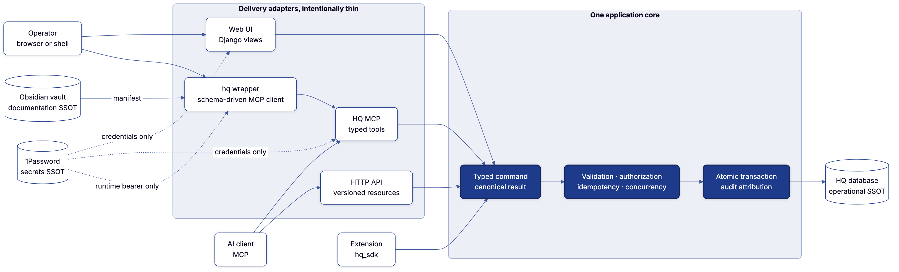
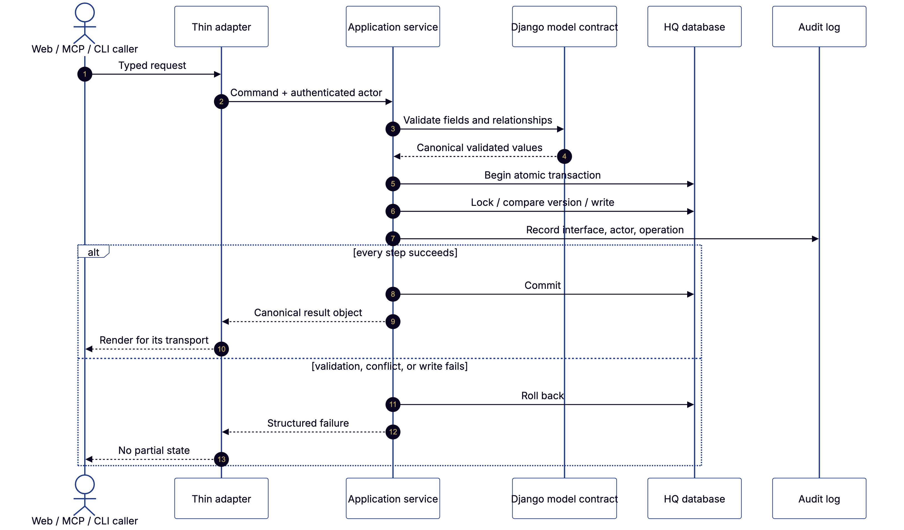
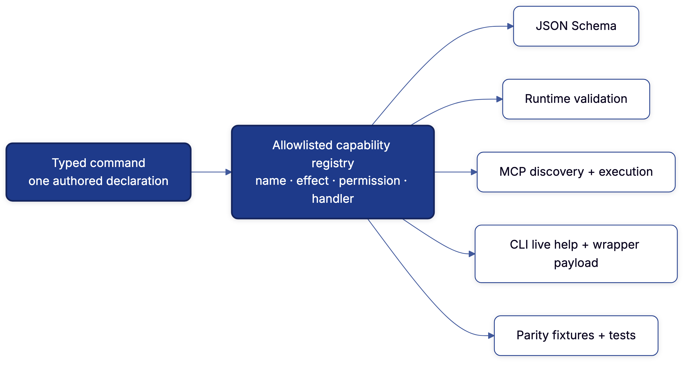
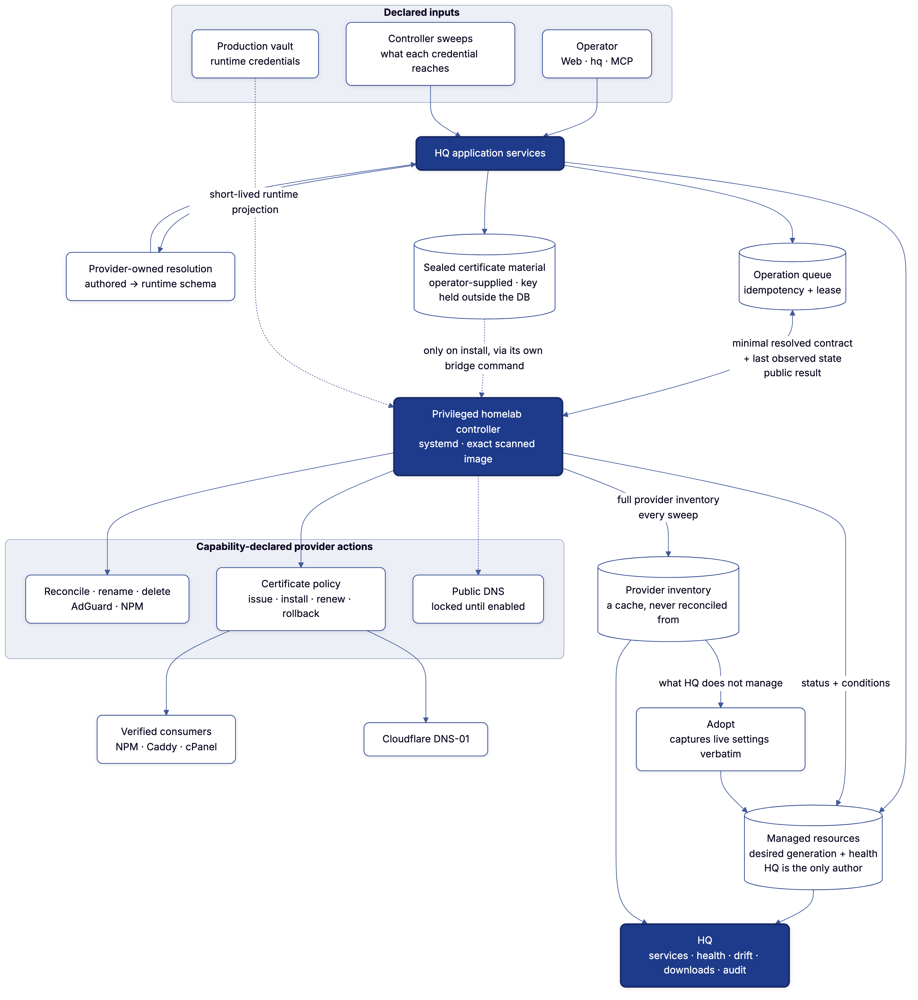

# One HQ brain, every interface

Severino HQ presents three faces: a fast operator web UI, typed MCP tools for
agents, and a dependable CLI for shell workflows and recovery. They are not
three implementations. They are three adapters over one application core.



<sup>Diagram source:
[`application-core.mmd`](diagrams/application-core.mmd), rendered with the
canonical [`diagram`](https://github.com/joeseverino/tools/tree/main/bin/diagram)
tool.</sup>

## The boundary

The `hq/platform/application/` package is HQ's behavior boundary. It owns everything that
must remain identical no matter who initiated an operation:

| Concern | Canonical owner |
|---|---|
| Request shape | Typed application command |
| Field and relationship validity | Application service + Django model contract |
| Authorization policy | Application service |
| Idempotency and stale-write protection | Application service |
| Transaction and locking boundary | Application service |
| Persistence | Django ORM inside that transaction |
| Actor and interface attribution | Shared audit context |
| Returned data | Canonical result object |
| HTML, MCP JSON, terminal prose | Delivery adapter only |

A Django view may translate a form. An MCP tool may translate typed arguments.
The `hq` wrapper may translate ergonomic flags into the advertised JSON Schema.
None may decide what a valid HQ mutation means or write around the service.

## One operation, end to end



<sup>Diagram source:
[`operation-lifecycle.mmd`](diagrams/operation-lifecycle.mmd).</sup>

The same lifecycle applies to a browser submit, MCP tool call, or CLI command.
The adapter disappears after parsing. The application service validates,
authorizes, opens the transaction, protects against stale state, writes, audits,
and returns one stable result. The adapter only chooses how that result looks.

That boundary includes reads. `hq.platform.application.resources.ResourceSpec` is the
registry of readable domains; canonical query projections live in their
application services and in `hq/platform/application/read_models.py`. Web, API, MCP, and
CLI adapters may filter or render those results, but they do not import Django
models or rebuild result shapes.
The projections opt into Django 6.1's `FETCH_RAISE` mode after declaring their
`select_related()` plans. An omitted relationship therefore fails at the
projection boundary instead of silently becoming an N+1 query in production.
An architecture fitness test rejects direct model access from the MCP service
adapter so this separation cannot silently regress.

The dashboard follows the same contract. `hq/platform/application/dashboard.py` emits one
JSON-safe operating snapshot for KPIs, priority work, recent records, upstream
state, and activity. The web dashboard renders it, while the authenticated MCP
exposes it as `dashboard_snapshot`. Infrastructure reads are likewise shared:
the `infrastructure.resources` kind, read through MCP's `list_resource` and
`get_resource`, returns public desired state, health, and structured operation
evidence without provider credentials. Its detail record also returns `derived`, from
`hq/platform/application/resource_context.py`: the same allowed actions, removal mode,
machines, services, readout and certificate expiry the resource page shows,
so no adapter derives a fact another cannot return. The tailnet and
connections pages follow the same pattern: `hq/platform/application/tailnet_context.py` and
`hq/platform/application/connection_context.py` derive each page once, the view renders
the projection object and nothing beside it, and the `tailnet` and
`connection.standing` resources serialize that object. How HQ reaches a
connection (network, machine, tailnet peering) is `hq/platform/application/connection_reach.py`,
joined from the endpoint, HQ's DNS readings, the machine catalogue and the
peering the machine page shows. Days left anywhere come
from `hq/platform/application/expiry.py`. A
future REST/OpenAPI adapter can publish these same use cases without moving or
reimplementing their behavior.

The page-head glance is also a projection, never an owner. Whole-host CPU,
memory, and storage observations are stored as the machine's telemetry reading
(`machine-telemetry:<key>`, `hq/platform/application/readings.py`), so its machine page, resource API, and
dashboard summarize the same timestamped fact. The operator selects that owner
with “Show on dashboard” on the machine edit form; the relationship lives in
`DashboardConfiguration`, not in deployment environment or desired machine
state. NWS data is separately owned by the dashboard-configured point's
`WeatherObservation`; its coordinates and labels are edited in the dashboard
Settings popover. Reading the glance (`GET /dashboard/glance/`) only reads
them. A refresh is a CSRF-protected POST to the same address: the refresh
button asks for every panel, and the dashboard, when it opens on a reading
older than five minutes, asks for the stale panels only (`scope=stale`). Either
way HQ records a credential-free `DashboardRefreshRequest`, rings the existing
controller doorbell, and the responsible controller derives its target and
connection from the machine graph. The browser follows that one request for a
bounded interval; it never installs a page-lifetime polling loop.
An SSH-capable connection yields whole-host readings. A Portainer fallback is
explicitly labeled as container and Docker scope rather than being presented as
machine utilization.

Priority work has one source: every domain's `Insight` provider is composed by
`domain_attention_items()`. The dashboard preview, `/action-items/`, and the
machine snapshot project that same queue; none owns a parallel inbox. Derived
topology findings enter through the infrastructure provider and drill into an
evidence/remedy surface, where remedies remain references to registered
capabilities rather than a second mutation path. Every finding rule also
declares `operator_action`, the exact thing a person does when HQ offers no
operation or the reader may not run it. A finding carries it as its
`steps` (`OperatorStep`: a label, a command HQ never runs, notes), or more
specific steps of its own; the API returns them as `operator_steps` beside the
remedies.

Every item HQ raises, a finding or a queue entry, carries help, never bare
prose: a remedy HQ runs, the exact command to run, or HQ's specific reason it
can offer neither. A rule must also declare `no_help_reason`, which a finding
carries (and the API returns) whenever it has no remedy and no command. A
queue `Insight` keeps the SDK's shape, so its help travels in existing fields:
a remedy as one of its `actions`, a command or a reason as a `run` or
`cannot` step of its `workflow` (`hq/platform/application/item_help.py`).
`hq/platform/application/tests/test_item_help.py` fails on any host provider that builds an item
without one.

A rule is declared beside the detector that decides it: each module that raises
findings (`perimeter_findings`, `controller_findings`, `docker_estate`,
`dns_findings` and the rest) exports its own `RULES`, built from the vocabulary
in `hq/platform/application/finding_model.py`. `hq.platform.application.findings.RULES` is derived from
the closed `RULE_MODULES` tuple, and that module keeps only the pipeline: the
estate, derivation, suppression, resolution and serialization.

The flattened queue preserves each insight's `action` and JSON-safe `workflow`
(or `null`) alongside its existing label, evidence, severity, count, and URL.
The dashboard and full queue share the same row partial and resolution renderer;
workflow forms retain their canonical action URLs, HTTP methods, and CSRF
protection. Rendering a workflow does not execute it or grant authority.
Neutral and good insights remain outside this queue; the contributing domain
owns whether a reading requires a decision.

Dashboard machine and weather readings are explicitly labeled snapshots. Their
observation time remains visible at every viewport size, and a reading at least
one hour old is marked out of date. This is presentation freshness, separate
from the provider's reported health; refreshing keeps the previous observation
visible until a new one arrives.

The browser groups dashboard cards by their contributing domain. Card providers
are evaluated once per projection scope and still undergo cross-domain collision
validation. A contributor with multiple metrics may supply its existing typed
`DomainOverview` for the displayed metrics and optional directly visible visuals;
single-card contributions remain compact. The host never infers domain identity
from a card ID or invents the contributor's reporting window. The machine
snapshot retains its existing flat cards; the richer grouping is presentation.

Higher-order findings preserve the same rule. Exact resource and kind facts
remain addressable, while the default projection follows topology edges to
group downstream symptoms under a proven shared controller. The frontend then
renders the subject's already-authorized actions as “what HQ can do now”; it
does not maintain a parallel action catalog. Focus and dependency-trace links
are application-level actions too: findings, topology, connection views, and
machine adapters all receive one canonical topology address rather than
reconstructing query strings. A stale-controller finding also derives the
registered controller-refresh capability from that same node. Executing it
rings the existing credential-free doorbell; the privileged controller still
pulls work and decides what is due, so a natural remediation loop does not
reverse the trust direction or create a second scheduler. "Read now" is the
same capability with a subject: a stored `ReadRequest` that HQ's `sweep-due`
answer turns into the kinds the controller reads next, so the controller still
pulls and HQ still decides. Contextual command
links carry a same-origin return path through Command Center's result screen,
so execution stays on the canonical command spine without losing the workflow
that proposed it. The resolution-plan primitive itself is domain-neutral and
exported through `hq_sdk.workflows`: a domain emits a stable claim, supporting
actions, authorized remedies, and its own verification action; HQ derives the
ordered understand → act → verify projection and the machine-readable
`claim_absent` completion condition. Infrastructure is merely its first
producer. Analytics freshness follows the
same shape: successful site-day coverage is a fact, HQ derives missing windows,
and the controller executes that plan without owning a second backfill policy.

Large projections run inside `hq.platform.application.projection.projection_scope()`. A
reading may be reused while one answer is assembled and is discarded when that
scope exits, eliminating repeated joins/counts without serving process-cached
state to a later request. The dashboard's contact rows, unread total, and
upstream health likewise arrive from one D1 request, which
the scheduled `contacts.inbox` job makes hourly
(`severino-hq-contacts-inbox.timer`) and a D1 write repeats after it changes a
submission. Pages, the header count and search read the stored result.

The dashboard projection has an executable query budget. Growth that adds an
unbounded query or N+1 relationship fetch fails CI before it becomes an
operator-visible latency regression.

### What a page costs

`manage.py bench_pages` measures it. The command builds Django's test database
(never the real one), fills it with `hq.platform.core.bench.seed` (a few years of
one operator's records: 4,000 expenses, 3,000 receipts, 300 assets, 6,000 audit
rows, a swept estate of about 270 managed resources), and requests every route
that answers a GET as a signed-in operator through the whole middleware stack.
It reports median and p95 time, the query count, how many of those queries
repeat one already made in the same request, and the response size.

```bash
DJANGO_STATIC_ROOT=/tmp/hq-static python manage.py bench_pages
python manage.py bench_pages --only dashboard --sql     # one page, with its queries
python manage.py bench_pages --scale 0.25 --rounds 10   # a quicker pass
```

The pages come from the URL configuration. A route that takes arguments is
requested with the seeded record `SAMPLES` names for it, and one with no sample
is listed under "Not benched", so a new detail page appears there until it has
one. An empty database hides every cost that grows with rows, which is why the
bench seeds first.

Timings move with the machine; query counts do not. Compare two trees by
running them back to back and reading the counts first.

A running HQ says the same of each request. Every response carries
`Server-Timing: app;dur=<ms>`, the application's own time, which a browser's
network panel shows beside the request, and the access log line
(`severino.request`, `duration_ms`) is written from the same measurement. A
request at or over `SLOW_REQUEST_MS` (`hq/platform/core/middleware.py`) is
logged as a warning, so it is found at any log level.
`hq/platform/core/tests/test_page_budgets.py` pins the counts below against the
same seed, at two sizes where a per-row read would show.

Measured 2026-10-04 on an 8 GB M3, Python 3.14, the lower of two paired runs
(median ms, queries). Pages not listed did not move beyond run-to-run spread.

| Page | Before | After | Queries before | Queries after |
| --- | ---: | ---: | ---: | ---: |
| Dashboard (`/`) | 140.0 | 121.3 | 97 | 53 |
| Action items | 158.4 | 141.2 | 71 | 27 |
| Action item count (header) | 104.9 | 85.2 | 69 | 25 |
| Findings | 133.6 | 113.6 | 61 | 17 |
| Topology | 121.3 | 96.8 | 61 | 17 |
| Services | 74.2 | 59.2 | 60 | 16 |
| One service | 79.8 | 63.7 | 65 | 21 |
| One machine | 72.1 | 56.7 | 65 | 21 |
| One resource | 68.0 | 51.7 | 64 | 20 |
| Tailnet | 92.5 | 72.7 | 63 | 19 |
| Calendar | 51.6 | 36.7 | 60 | 16 |
| Search (`?q=example`) | 139.2 | 124.4 | 76 | 32 |
| Year summary export | 100.1 | 31.4 | 617 | 27 |
| Expenses | 11.2 | 9.0 | 8 | 8 |
| API `findings` | 98.3 | 77.7 | 61 | 17 |
| API `topology` | 86.3 | 68.6 | 61 | 17 |
| API `action.items` | 104.9 | 84.8 | 70 | 26 |

The same pages once their derivations are stored (below), the audit capture is
taken lazily and search reads the index once. Measured 2026-10-04 on the same
machine and method: two paired runs of 15 rounds, the lower median of each
side. The median difference between two runs of one tree was 1 ms; pages not
listed moved by less than twice their own spread. "Derived" is how many
derivations the measured request ran: every page between two changes of the
estate runs none, where each ran the topology, the catalogue, the findings and
the queue it needed.

| Page | Before | After | Queries before | Queries after | Derived after |
| --- | ---: | ---: | ---: | ---: | ---: |
| Dashboard (`/`) | 118.6 | 45.0 | 53 | 44 | 0 |
| Action items | 140.2 | 62.1 | 27 | 7 | 0 |
| Action item count (header) | 83.8 | 7.4 | 25 | 5 | 0 |
| Action item count, validator presented (304) | 83.8 | 0.6 | 25 | 3 | 0 |
| Findings | 113.2 | 45.8 | 17 | 6 | 0 |
| Topology | 96.3 | 41.1 | 17 | 6 | 0 |
| Topology node | 79.8 | 20.9 | 15 | 4 | 0 |
| Services | 59.8 | 47.3 | 16 | 14 | 0 |
| One service | 64.2 | 26.8 | 21 | 19 | 0 |
| One machine | 57.0 | 19.5 | 21 | 20 | 0 |
| One resource | 51.4 | 12.7 | 20 | 18 | 0 |
| One domain | 59.2 | 23.2 | 25 | 22 | 0 |
| Tailnet | 73.2 | 15.2 | 19 | 14 | 0 |
| Calendar | 36.5 | 20.8 | 16 | 14 | 0 |
| Search (`?q=example`) | 123.3 | 47.2 | 32 | 22 | 0 |
| Search (`?q=purchase`) | 79.6 | 27.7 | 25 | 15 | 0 |
| Expenses, searched | 35.5 | 17.8 | 9 | 8 | 0 |
| Audit log, searched | 47.3 | 34.0 | 8 | 7 | 0 |
| Expenses CSV | 173.2 | 114.7 | 10 | 10 | 0 |
| New receipt | 162.8 | 125.9 | 6 | 6 | 0 |
| API `findings` | 78.4 | 12.4 | 17 | 6 | 0 |
| API `topology` | 68.9 | 13.8 | 17 | 6 | 0 |
| API `action.items` | 85.8 | 7.5 | 26 | 6 | 0 |

The first request after a change derives what it needs and stores it, about
five statements per derivation on top of the reads. One change of the estate
costs seven derivations in all, whichever pages ask first: the queue, the
catalogue, the relation graph, and the topology and findings once for the
queue's reader and once for the operator's.
`hq/platform/core/tests/test_page_budgets.py` pins both: the queries of each
stored page at two sizes with no derivation run, and the derivations a change
costs.

### A part of a page

A page that changes one region does not fetch itself to do it. The region
asks for its part by name (`X-Fragment`), the view renders that
`` of the page's template, and a part whose inputs are known
by revision answers "unchanged" with 304 (`hq.platform.application.fragments`;
`docs/DESIGN.md` has the contract). `bench_pages` reads each page it requests
for the parts it names and the validator it hands out, and measures those
beside the page, so a new part is measured without being listed.

Measured 2026-10-04 on an 8 GB M3, Python 3.13, scale 1.0, 15 rounds (median
ms, queries, kilobytes). "Page" is what the same interaction fetched when it
took the whole document.

| Interaction | Page | Part | Queries | KB |
| --- | ---: | ---: | --- | --- |
| Dashboard: page the month | 53.8 | 20.6 | 44 to 12 | 166.6 to 72.5 |
| Dashboard: save the links | 53.8 | 9.6 | 44 to 9 | 166.6 to 31.9 |
| Dashboard: a glance poll that finds nothing written | 2.7 | 0.6 (304) | 6 to 3 | 1.8 to 0 |
| Calendar: page the month, check a source | 27.0 | 21.2 | 14 to 12 | 92.7 to 77.5 |
| Connection dialog | 14.2 | 10.2 | 12 to 10 | 43.9 to 29.0 |
| Policy test, asked again | 21.5 | 14.3 | 14 to 12 | 18.1 to 0.1 |

`hq/platform/application/tests/test_fragments.py` holds the dashboard to
composing only the part asked for, and the poll to answering 304 until
something is written.

### Derived once per change

The topology, the service catalogue, the findings and the action queue are
functions of a few tables, of who is reading, and of the clock. They are
declared as such, once, and computed once per change of those inputs rather
than once per request:

```python
@derivation("estate.topology", reads=ESTATE_READS, vary=estate_variant)
def _derive(principal): ...
```

`hq.platform.application.derivations` answers a call from the projection in
progress, then from the `derived` cache, then by running the function and
storing what it returned. The cache is Django's database cache, in the same
SQLite file, so every process reads one copy and a value stored inside a
transaction commits or rolls back with the rows it was derived from. The key is
the derivation's name, what `vary` returns for the arguments, and the revision
of every table in `reads`.

**Revisions.** `core.Revision` holds one counter per table. Three triggers on
every model table (insert, update, delete) move it inside the writing
statement, so `save()`, `QuerySet.update()`, `bulk_create()`, a cascade and raw
SQL all move it, in a transaction or in autocommit, and a counter never commits
apart from its rows. `hq.platform.core.revisions.install` puts the triggers on
after every `migrate` (SQLite drops them when a migration rebuilds a table),
creates the cache table and clears it, so a value derived by the previous
build is never read by the next. Reading the revisions also reads which
triggers exist, in one statement; a table without its triggers has no
revision, and its derivations run on every call.

**The clock.** A derivation does not read the clock. It asks `reached`,
`passed`, `since`, `whole` or `today` (and `expiry.days_until`), and each
answer records the moment it stops being true. A stored value carries the
earliest such moment and is derived again after it: a certificate crosses its
warning threshold, a reading goes stale and "3 hours ago" becomes "4 hours ago"
on time, with no write. Ages a template prints (`|when`) are rendered per
request from the stored timestamp.

**What else it varies by.** `estate_variant`: the reader (a projection is
narrowed to what they may see), the address and port the request reached HQ on,
and whether HQ is in use, which sets the sweep interval a finding quotes.
A person's pins and set-aside items are applied after the derivation.

**It fails toward deriving.** Revisions that cannot be read, a missing
trigger, an unreadable cache or a value that does not load all mean the
function runs. A derivation that reads a table it did not declare is logged
and never stored; one that calls another must declare the other's tables or
the call raises. `test_derivations` holds every declared derivation to its
`reads` over the bench estate, forbids a direct clock read inside one, and
writes a row every way Django can to show the revision moves.

The declared derivations are `estate.topology`, `estate.relations`,
`estate.findings`, `estate.services` and `attention.queue` (the host's whole
queue; an extension's items are gathered per request and merged in). A new one
is a decorator and a line in `SAMPLES` in that test. `derivations.uncached()`
runs a block with the store bypassed, for budgets on what a derivation itself
costs.

**The header's count** (`/action-items/count/`) answers a conditional request.
Its `ETag` names the queue's key, the person, the revision of their set-aside
rows and the second the answer stops holding; a request that presents it while
all of that stands is answered `304` from three queries without composing the
queue. A queue that includes an extension's items carries no validator.

What a stored page still costs is its own reads and its template: the
findings page renders 700 KB, and the record forms that offer every expense as
an option (new receipt, new documentation, new content) render 4,000
`<option>` elements. Those are changes to the page, not to a derivation.

### What a request waits on

Nothing outside the process. A page or a button answers from what HQ holds;
work that reaches a network, starts a process or sleeps happens where waiting
costs nobody:

- **A reading of the outside world is the controller's.** It holds the
  credentials and the egress, and reads concurrently. The web side stores a
  read request (`hq.platform.application.cadence.request_reads`), rings the
  doorbell and answers; the reading arrives through the sweep's ingest. A
  reading whose provider rations calls keeps a clock of its own
  (`ObservationSpec.every`): HQ tells the controller when it is due, and the
  sweeps between carry it without a call. `github.profile` is the example: the
  profile and stars behind Watching, read without a credential, at a cost the
  bridge contract's `GitHubProfileBounds` states once.
- **Long local work is a job** (`hq/domains/jobs/`): its own thread, progress
  notes, a heartbeat, one live job per kind. A project's refresh is one.

The request that asks answers at once, in one shape for both
(`hq.platform.application.asks`): how the work stands, and while it is live
the address of a status resource, with 202. `partials/_ask.html` draws the
control and one script behaviour follows it; `docs/DESIGN.md` has the
interaction.

The rule is held by the interpreter rather than by review
(`hq/platform/core/outbound.py`). Python raises an audit event whenever any
library opens a connection, resolves a name, starts a process or sleeps. While
a request is being served that event raises `OutboundInRequest`, so the call
never leaves, whichever library made it. A place a request must wait is a named
entry in `ALLOWED` with its reason, entered with `allowed("name")`: signing in
(bounded by `OIDC_TIMEOUT`), a public lookup an operator asked for by name, and
the contact submissions that exist only in the site's database.
`RequestNeverWaitsTests` holds the entries to the places listed.
`SEVERINO_OUTBOUND_IN_REQUEST=report` logs `outbound.in_request` and lets the
call go, for a composition whose extensions still reach out from a request; an
extension moves that work to `hq_sdk.jobs`.

`bench_pages` measures actions as it measures pages: every route that answers a
POST is one, `ACTIONS` names what each is posted, and one with no entry is
listed under "Actions not exercised" with `UNSAFE`'s reason where it cannot be
posted against a scratch database. An action is posted inside a transaction
that is rolled back, with the doorbell unrung and a job's work held, so the
time is the request's own. `hq/platform/core/tests/test_action_budgets.py` pins
each converted action's queries at two sizes of estate and asserts it answers
before the work it asked for.

Measured 2026-10-04 on an 8 GB M3, Python 3.13, scale 0.25 (median ms, queries):

| Action | Before | After | Queries after |
| --- | ---: | ---: | ---: |
| Watching: Refresh | 30,031 (production, read in the request) | 3.7 | 23 |
| Project: Refresh | one GitHub call, and a site fetch for the index project, in the request | 2.2 | 13 |
| Connections: Read now | answered with a redirect | 3.4 | 20 |
| A page asking for its readings | answered as JSON | 9.5 | 17 |

This is the important scaling property: a fourth interface does not create a
fourth implementation.

## Search and table reads

`hq.platform.application.search` is the search boundary for web tables, CLI/TUI clients,
and future MCP tools. It accepts a named scope and query and returns stable
domain identifiers; adapters do not know how text is indexed.

Every entry point requires a `Principal`. Ordinary scopes need the baseline
`READ` capability; the `audit` scope needs `READ_AUDIT_LOG`, which
least-privilege adapter principals (MCP) do not hold: free-text search over
the security log is an operator-only capability. A new adapter therefore
cannot expose search without deciding whose authority it acts under.

`global_search` is the cross-scope use case behind the `/search/` page:
relevance-ranked hits per scope with FTS5 `snippet()` match extracts,
returned as structured `(text, is_match)` parts so each renderer escapes
content and applies markup independently. Presentation metadata (group label,
title field, badge, timestamp) lives on the `SearchDefinition` carried by its
`ResourceSpec`, so every surface labels a hit the same way. Scopes a principal
cannot search are omitted from the result, not rendered empty. Contact submissions live
in Cloudflare D1, not the local database; the web view merges the stored inbox
rows (matched by submitter name) as an eighth group beside the registry scopes.
Email and message text are searched on the contacts page, which reads D1.

Ranking is stated once, in the backend: FTS5's `rank` (bm25, lower is better),
then object id compared as text, numbered per scope with `ROW_NUMBER()`. Every
read is that statement. `global_search` asks it about every scope the principal
may search in one query, keeps the first hits of each scope, and reads their
`snippet()` from a second reference to the FTS table, because an FTS5 auxiliary
function is only valid in the query that reads the table with `MATCH`; a scope
with no hit costs no record fetch, and a scope the principal lacks is never in
the statement. A searched list annotates each row with its position among those
hits (`_search_rank`, NULL for a row that is not a hit) through a subquery whose
ranking is materialized once, so the statement has the same three parameters
whether three rows match or five thousand, and the list's order is the index's
order for every match. Equal ranks are ordered by object id as text, so `10`
precedes `9`: one rule for every scope, independent of how the index stores its
rows. Without the FTS table there is no rank: the ORM fallback matches by
substring and a list falls back to primary-key order.

`search_index.SearchDocument` is a derived relational projection. On SQLite,
an FTS5 external-content table indexes that projection with Unicode tokenization
and 2/3/4-character prefix indexes. Database triggers keep the FTS structure
atomic with projection writes, while domain-model signals keep the projection
atomic with the authoritative record. A rollback therefore removes all three
changes together.

The backend is replaceable. A future PostgreSQL deployment can supply a native
search backend without changing table views, query parameters, CLI output, or
domain models. When an indexed backend is unavailable, the application service
retains a bounded ORM fallback.

Operational interfaces use the same contract:

```bash
python manage.py search_hq projects "certificate automation"
python manage.py rebuild_search_index
```

`hq.platform.application.tables.TableListMixin` composes indexed search with multi-value
filters, workflow toggles, allowlisted ordering, and database pagination. The
browser progressively enhances that GET contract with debounced, cancelable
requests; plain links and forms remain the complete fallback.

## Emit once, derive everywhere



<sup>Diagram source:
[`emit-once-capabilities.mmd`](diagrams/emit-once-capabilities.mmd).</sup>

HQ's allowlisted capability registry binds each typed command to one operation
name, effect, required permissions, and application handler. From that registry:

- `describe_capabilities` emits deterministic JSON Schemas for MCP clients;
- `execute_capability` validates a JSON object and returns one canonical
  success/error envelope;
- the authenticated Streamable HTTP MCP endpoint exposes that catalog and
  executor to the web-independent CLI and agents;
- the Command Center derives an authorized browser form and machine-contract
  view for every capability, including plugin capabilities, without a
  capability-specific view or template;
- management commands remain an in-process break-glass adapter over the same
  registry; and
- tests derive their contract assertions from the emitted schemas.

The generic executor is not generic database access. It can invoke only
allowlisted operations in the registry, and every operation still crosses the
typed principal, capability check, and application transaction.

Reads use the parallel `ResourceSpec` contract. One declaration states whether
a resource is searchable, listable, addressable, or any combination; binds its
required capabilities; and supplies a strict Pydantic query schema. The API and
MCP generic readers execute only registered handlers, while the search index
derives its core definitions from the same specs. Plugin resource names and
search scopes are collision-checked at composition startup, and handler
signatures are checked before the first request.

Managed infrastructure uses that same search projection. Provider and kind
names such as `tailscale` or `cloudflare` therefore return the locally stored,
clickable resources alongside the connection family that can reach them;
Command Center keystrokes never invoke a provider.

External access uses the third declarative registry, `ConnectionSpec`. It says
which family exists, what abilities and provider scopes it can carry, which
principal may inspect it, and how to read locally cached instances. Static
discovery never invokes instance providers; the Connections workspace and
machine list adapters do, after authorization. A plugin can therefore add an
integration without adding host templates or adapter registrations, while a
search keystroke can never trigger provider I/O. Runtime instances deliberately
have no secret field and relationship links are restricted to local or HTTP(S)
destinations. Endpoint metadata is display-only: URL userinfo, query strings,
and fragments are rejected both when controller inventory enters HQ and when a
plugin instance leaves its provider. Permission is an evidence-backed
relationship rather than a label: an ability declares how its authority is
proven (scoped, whole-account or keyless), an instance reports what kind of
credential was observed, and HQ derives per-ability evidence and a per-connection
lifecycle from the two, failing closed on a missing or rejected grant and naming
an undeclared one instead of counting it as authorized. The controller's
connection providers carry their credential model in one declaration beside the
providers themselves, so reach reported by a sweep is never mistaken for
permission. The Connections security posture is a
query-free projection over that already-authorized catalog and the current
request; it does not perform a second sweep or claim to attest the external
router and firewall boundary that the process cannot observe.

The gateway that owns an endpoint owns this declaration. Host domains attach a
typed connection callable to their domain integration; an extension emits its
connections beside its capabilities and resources through one
`PluginIntegration`. Adding a gateway therefore consists of one local
contribution rather than edits to the Connections page, Command Center, API,
MCP, and topology separately.
Keyless services are connections too when they provide a real external boundary.
A provider emits cached/configured truth even when it currently has no token
(for example, public GitHub access), and status describes that reduced mode.
Supplying credentials upgrades the observation; it does not create a second
kind of integration.

At composition, HQ compiles those independently emitted specs and standalone
search projections into one frozen `IntegrationGraph`, indexed by stable name.
The compiler owns intrinsic contract validation, uniqueness, and every
cross-spec edge; emitters only emit typed records. Direct compiler callers
therefore receive the same guarantees as the runtime composition rather than a
weaker registry assembled around the checks. It collects violations across all
contributions in one pass, so one failed composition reports the complete
repair list. The valid graph is memoized for the process because composition is
fixed at image boot.
The one plugin-composition reset clears both plugin identity and the derived
graph; the test runner applies that reset between fixtures, while isolated
composition proofs use an explicit graph override.
There is no second public assembly or validation path.

The web Command Center is a projection of that graph, not another inventory.
Its resource links come from `ResourceSpec.web_route`, and a
`CapabilitySpec.subject_resource` connects each operation to the domain it acts
on. A matching `ConnectionAbility.subject_resource` plus `governs_kinds`
connects a searched external-system ability to the registered commands that can
act on those kinds; `ConnectionAbility.capability` names an exact command when
the operation is not resource-shaped. That ability is the sole authored
connection-to-capability edge; the capability does not repeat a reciprocal list
that could drift. This is a registry join, not a command
invented from a credential scope: only a real typed handler can become
executable. Every permitted command links to one generic execution surface. The host
derives its controls from the canonical JSON Schema, rejects unknown and
repeated form fields, uses the registered operator-facing target label, and
derives eligible target choices through the authorized local `ResourceSpec`
query; opening a command never calls a provider. A zero-network browser preview
reflects the selected target and reason beside the registered handler, resource,
authority, effect, and execution notes, then invokes `execute_capability`; it
does not reimplement a handler. Retry keys are generated and hidden,
infrastructure/destructive effects require explicit confirmation, and
successful writes use POST/Redirect/GET. The same query
filters resources, commands, and connection families while global search
supplies live record hits. A plugin that contributes any spec appears in both
discovery and execution without a host edit. Cross-spec references are compiler
invariants. Reversible web routes remain a Django startup check because URL
resolution belongs to that adapter.

The infrastructure Topology workspace is the relational projection of the
same declarations and observations. `ConnectionSpec` supplies abilities,
`ConnectionInstance` supplies observed targets and dependencies, controller
readings identify their observer, and `ManagedResource` supplies desired-state
nodes. One application function emits the normalized node-and-edge graph used
by web, HTTP API, and MCP. It stores no snapshot. Its actions point back to
canonical capabilities and web use cases, so manipulating a node still crosses
the existing authorization, validation, audit, transaction, policy, and retry
boundaries rather than editing a parallel graph.

The HTTP API and Command Center add durable retry semantics around that executor.
Every state-changing capability requires an actor-scoped idempotency key; the
canonical request hash and exact response commit in the same transaction as the
domain operation. A dropped response or process restart can therefore be
retried without repeating a non-idempotent plugin write. This adapter guard
does not replace domain idempotency, which continues to protect the same use
case when invoked through any interface.

The executor itself takes a retry key from every interface. A capability whose
effect is not `read` accepts an optional `idempotency_key` in its payload:
`capability_schema` in `hq/platform/application/integration_specs.py` derives that from the
effect for the published schema and for unknown-field rejection, and
`execute_capability` replays the first result for a repeated key. A command
type declares the field only when its handler stores the key with what it
queues; no capability declares whether it accepts one.

## Source-of-truth map

"Single source of truth" is scoped by domain. Pretending one database owns
everything would make the system less honest, not more unified.

| Domain | Source of truth | What HQ stores |
|---|---|---|
| Authored documentation | Obsidian vault | Validated metadata, relationships, and vault pointers |
| Projects, assets, expenses, workflow state | HQ database | Authoritative operational records |
| Credentials and tokens | 1Password | Nothing secret, with one declared exception below |
| Which connections exist, what they permit, and what each reaches | Owning provider or 1Password/controller | A typed, timestamped `ConnectionInstance`: never the credential, never a second list |
| Mutation behavior | `hq/platform/application/` | The one executable business contract |
| Interface presentation | Web / MCP / `hq` wrapper | No business state |
| Which machines exist, and what reaches them | Sweeps, plus a declaration for what nothing sweeps | Derived first; declared only where nothing can observe |
| Desired infrastructure state | HQ database | The only copy |
| What a provider actually holds | The provider | A timestamped cache, never reconciled from |
| Provider authored/resolved contracts | Provider definition registry | No parallel resolver schema |
| Controller actions and automation | Validated controller capability document | Queued operations and observations |

The one exception to "nothing secret" is a certificate an operator generated
themselves and asked HQ to install. It is sealed with a key held outside the
database, refused outright when that key is absent, read only by the controller
through its own bridge action, and absent from every serializer. Provider
credentials remain outside the web container entirely.

The vault emits a validated manifest; HQ never walks the vault and never stores
Markdown bodies. The MCP does not become a database or a second rules engine.
It exposes the same application capabilities used in-process by HQ itself.

## Reference vertical slices

### Projects

`hq.platform.application.projects.save_project()` is the sole project create/update path.
The web create and edit views, MCP `execute_capability` tool,
and `create_project` management command all call it and receive the same
canonical representation.

Project writes provide:

- Django field and uniqueness validation;
- an atomic transaction;
- row locking for updates;
- optional `expected_updated_at` conflict detection;
- stable relationship-safe serialization; and
- audit metadata naming the interface, actor, and operation.

### Documentation synchronization

`hq.platform.application.sync.execute_hq_sync()` is the external synchronization boundary.
The local Vault MCP emits the manifest; `hq sync` sends it in one `hq.sync` MCP
capability call, applied inside one database transaction. The vault describes
documentation and nothing else; HQ derives the infrastructure topology.

The sync is:

- atomic and safe to repeat;
- preflight-validated against the canonical frontmatter contract;
- bounded to 2,000 JSON-object records;
- incapable of importing Markdown bodies; and
- fail-closed for deletion: pruning requires `prune_orphans=true` and the
  separate `confirm_prune=true`.

### Assets

`hq.platform.application.assets.save_asset()` extends the same contract to equipment and
financial metadata. Web create/edit, MCP `execute_capability`, and
the `create_asset` management command share one transaction and result shape.
The service resolves project relationships before writing, rolls back on any
missing slug, normalizes deductible values through the model contract, and
supports the same optional stale-write protection as Projects.

### Content

`hq.platform.application.content.save_content()` owns the publishing pipeline record and
its Project, Asset, Expense, and Documentation relationships. All relationship
identifiers resolve before persistence, so one missing reference rolls the
entire operation back. MCP results omit sensitive and restricted documentation
identifiers while the authenticated web UI can still manage the underlying
relationship through the same service.

### Expenses

`hq.platform.application.expenses.save_expense()` owns financial record creation and
updates, deductible calculation, and its optional Project, Asset, Content, and
Documentation links. Related identifiers resolve before persistence, updates
lock the row, and MCP/CLI results share the same money-as-string representation
without disclosing sensitive documentation identifiers.

### Receipts

Receipt files and receipt metadata deliberately have different ingress paths.
Authenticated web upload calls `hq.platform.application.receipts.upload_receipt()` and the
shared file policy before private storage. JSON/MCP exposes only
`receipt.update`, which can change metadata and stable Expense/Asset links but
can never read, upload, replace, or return file bytes or a storage path. The
schema-derived capability therefore stays plug-and-play without turning the
MCP into a file-exfiltration surface.

### Documentation records

`hq.platform.application.documentation.save_documentation()` owns manual documentation
metadata creation and updates. It resolves all Project, Asset, and Expense
relationships before persistence and returns a sensitivity-aware canonical
representation. Restricted records remain manageable in the authenticated web
UI, while MCP and CLI results redact their vault, repository, URL, and notes
pointers.

### Deletes

`hq.platform.application.deletion` owns deletion for all six mutable HQ record families.
Every delete is an explicit registry capability with a `destructive` effect,
requires an exact target confirmation, locks the current row, optionally checks
`expected_updated_at`, and emits the normal attributed audit event. Receipt
storage cleanup runs only after the database transaction commits. MCP deletion
requires both ordinary writes and the separate delete switch; the CLI remains
an in-process recovery path.

## Security model

The service boundary complements the existing network boundary:

1. The MCP endpoint exists only on the tailnet.
2. `MCPBoundary` validates the direct peer, Host, and Origin, then the caller:
   an identity-provider access token naming the agent, the only credential it
   accepts. It then asks the operator's brake, all before tool dispatch.
3. Tools expose task-shaped capabilities, never generic SQL or arbitrary model
   mutation.
4. A typed `Principal` carries explicit capabilities into the application
   service; the service (not the adapter) authorizes the operation.
5. MCP starts read-only. `SEVERINO_MCP_ENABLE_WRITES` enables ordinary mutation
   capabilities. Destructive documentation pruning additionally requires
   `SEVERINO_MCP_ENABLE_PRUNE`; record deletion additionally requires
   `SEVERINO_MCP_ENABLE_DELETES`. These flags cap an agent's token too: it holds
   the intersection of its grant and what the deployment allows MCP.
6. Before a capability runs, `capability_policy.decide` answers allow, hold for
   approval, or deny, from the operator's rules for the surface and the agent.
   Held requests are decided in the audit log.
7. Application services revalidate all data and own transactional writes.
8. Restricted documentation is removed from AI-facing relationship results.
9. Every successful mutation leaves an attributed audit event, and every
   refusal a `Denied` one.

The operational boundary is observable without a hosted telemetry dependency.
Each HTTP response carries a server-generated request ID, and the same ID is
emitted with method, path, status, and duration in structured container logs.
Liveness proves only that the process responds; readiness separately proves
database access, migration parity, and writable runtime storage. Deployment
rollback trusts readiness rather than an authenticated page redirect.

Routine CLI domain operations use the authenticated MCP endpoint: synchronization,
registry validation, project/asset upsert, and report export. SSH is reserved
for host administration (deployment, logs, restart, shell, superuser, and secret
refresh). In-process management commands remain break-glass recovery paths, but
the normal CLI cannot silently become a second transport or rules engine.

## Adding the next capability

Every new write follows one mechanical path:

1. Define the typed command and canonical result in `hq/platform/application/`.
2. Implement validation, authorization, locking, persistence, and audit there.
3. Add minimal web, MCP, and CLI adapters.
4. Prove identical result shapes with an adapter-parity test.
5. Prove rollback and the relevant idempotency, permission, and conflict cases.
6. Document the capability here once it joins the supported surface.

Business logic in a view, MCP registration function, or management command is
an architecture regression and should fail review.
## Infrastructure control plane

**HQ owns the topology.** Every part of it is HQ's. A machine is derived from what a credential
reaches and what a sweep found, and declared only where nothing can observe one
(the printer, the offline CA). A certificate states its own names and the
targets it installs on. How a target takes a certificate is stated once on the
target, because that is a property of the place rather than of any certificate
sent to it.

Desired state therefore spans two resources: what a certificate says, and what
its targets say. Saving a target recomputes the desired state of everything
installed there and advances the generation of whatever resolved differently,
otherwise a certificate reports itself in sync against a world that moved
underneath it.

HQ stores typed operational intent, resource generations, public observations,
and audited operation requests. Each provider definition owns its authored
schema, reference resolver, and resolved runtime schema. Web, MCP, scheduler,
and controller contracts consume the same resolved provider output. HQ stores no
provider credentials. Every interface invokes the same application capabilities.

A provider definition also declares how it participates in the surfaces above
it: which facet of a service it supplies, how to read hostnames out of a
resolved spec, how to describe itself in one line, and how to rebuild a spec
from a record the provider already holds. Everything derived from that (the
service view, the generated create-and-edit forms, adoption) is written once
and names no provider, so a provider added to the registry appears on all of it
without another file being edited.

Each provider is one module in `hq/domains/control_plane/provider_adapters/`: its spec
models, its kind constants, the functions its declaration names, and the
declaration itself. The vocabulary those are built from (`ProviderSpec`,
`ProviderModel`, action policies, `NameContext`) is `hq/domains/control_plane/provider_spec.py`,
which imports no registry. `hq.domains.control_plane.providers.PROVIDERS` is derived from
the package's closed `ADMITTED` tuple, whose order is the registry's order; the
registry holds no list of kinds of its own.

A provider module also declares the connection its credential arrives through
(`CONNECTIONS`, a `ConnectionKind` per provider name), and
`hq.domains.control_plane.connection_kinds` gathers them from the admitted set. A kind that
names a connection provider no admitted module declares fails at import. A
provider's readings are a module of their own in `hq/domains/control_plane/observations/`;
the package registers every module beside `contract.py`, in name order, so a
new file is a registered reading. What may read it is still decided by
admission. Adding a provider is therefore writing its modules and adding one
name to `ADMITTED`; `hq/domains/control_plane/provider_adapters/tests/test_admission.py` holds
that to be enough.

Its relationships follow from the same declarations. Nothing in the topology
names a provider to draw its edges:

- A reading joins its subject through the `hostnames`, `addresses` and
  `containers` its spec declares. The edge from the connection that read it
  carries the spec's `relation` phrase.
- A kind that mirrors live records (`from_record`) is used by the connection
  holding its record. The record is matched to the declaration by the identity
  adoption uses, and read through the record's `connection_ref`, or else through
  the kind's `connection_providers`.
- A reading whose spec `connects` makes the declared containers it names talk
  to each other.
- A declaration whose spec has a `host` field runs on that machine.

**One address-to-machine resolver, in `hq/platform/application/locate.py`.** Every surface
that draws a line between two things HQ knows (a proxy and the box it forwards
to, a credential and the machine it opens, a service and where it runs) is
asking the same question. Surfaces differ only in what evidence they hand the
resolver, never in how it reads one.

Two invariants keep that from splitting. **Names and addresses are separate
namespaces**, because a machine may legitimately be named like an address while
another answers at it, and one dictionary silently keeps whichever was written
last. And **endpoints are parsed in one place**: `hq.platform.core.network.split_host_port`
because splitting at the last colon is right for `host:port` and wrong for
every IPv6 form. A rendered label is never a join key; the resolver joins on
declared addresses, sweep readings and connection endpoints, all of which are
facts rather than presentation.

**Identity is declared separately from hostnames**, because one name can carry
several records. A DNS zone apex routinely carries several TXT records, several
CAA records and two MX records, all on one name; identified by hostname they
would collapse into one, and adoption would keep whichever the provider listed
first. The types that carry policy rather than address declare no hostname at
all, so they would report as having no identity and stay invisible to the
screen built to find unmanaged records. A provider that holds more than one record per name
therefore says what makes each of them itself, and what it *serves* is answered
separately: for many record types, nothing.

Which surface offers creating a resource is likewise declared, not hardcoded: a
kind that is only meaningful inside something else names that surface, so the
generic "what do you want to add?" page never accumulates a hand-maintained list
of the kinds it is supposed to leave out.

Three verbs exist beyond reconciliation. **Delete** removes the record at the
provider and only then lets HQ forget its declaration, because the thing
described lives elsewhere and dropping the row alone would abandon it. **Rename**
is possible because the contract carries what the provider was last seen
holding: without it, a changed hostname would create a second record beside
the one it meant to move. **Adopt** takes a record the provider already holds and writes
its live settings into a new declaration, so the first reconciliation after
adopting changes nothing.

Two surfaces read those declarations, and neither stores anything. A **service**
is one hostname and everything that has to be true for it to answer, which is
the question asked when something is broken. A **domain** is one zone and
everything published in it, which is a different question with a different
answer: a DMARC policy, a CAA restriction and an MX record are not services and
never appear on that board, yet getting them wrong is how mail stops arriving
and how anyone in the world becomes able to obtain a certificate for the domain.
Both are derived from the same declarations plus the last provider sweep, so
they cannot disagree: being the thing that cannot disagree is the whole point,
and it is why there is no Service model and no Zone model.

What a domain page reports about a zone is stated descriptively rather than as
drift. HQ holds a credential that can read and write DNS records and nothing
else, so it cannot change a zone's TLS posture and does not get to have an
opinion about it. "DMARC: p=none" is true and useful; flagging it as drift would
invent a policy nobody declared and that nothing could enforce. The one
exception is a record that is wrong by its own definition rather than by a
policy: a left-over ACME challenge outlived the issuance it existed for, and is
garbage whoever you ask.

Certificates arrive two ways. HQ issues one from Let's Encrypt over DNS-01 and
keeps it renewed and deployed. Or an operator generates one against the offline
CA (which HQ cannot do, and does not pretend to, because the root key never
leaves that machine) and hands HQ the result to install and hold.

Controllers claim operations with an expiring lease and receive a minimal,
versioned, desired-only JSON contract. A controller resolves runtime connection
references, executes provider adapters, verifies each declared consumer, and
reports only public status and conditions. Expired claims return to the queue;
only one queued or claimed operation may exist for a resource/action pair.

A provider's declaration (its typed resource definitions and connections) is
Django's, admitted as a closed tuple in `hq/domains/control_plane/provider_adapters/`. Its
controller half is Go, in `controller/providers/`: one file set per
integration (`adguard`, `npm`, `caddy`, `cloudflare`, `github_app`,
`github_readings`, `github_delivery`, `portainer`, `tailscale`,
`tailnet_policy`, `tls`, `host_readings`, `glance`, `redirects`), each
registering its readers, actions and probes in `providers.New`. The controller
asks HQ for its declarations through the bridge's `registry` action, claims only
the declared actions it has a handler for, and refuses a locked action with the
registry's reason. Vendor responses decode into types generated from each
vendor's OpenAPI description (`controller/api/vendor/`); bridge messages into
types generated from `controller/api/hq-controller.openapi.json`. A Go test holds
the registered readers equal to the contract's `SweptKind`, and Django's contract
test holds `SweptKind` to the kinds HQ expects a sweep to read.

The bridge contract is written by hand and both sides take it. The
controller's client (every path, parameter and message type) is generated from
it, and HQ's bridge application builds its routes and parses each request from
the same document, so an action, a parameter or a limit exists once. What the
Go generator does not emit (a pattern, a default) the controller reads from the
copy embedded in its binary (`controller/api/contract.go`), and a declaration
reads from the same file (`hq/domains/control_plane/bridge_contract.py`): the
Caddyfile token patterns, the `github.delivery` defaults, the claim lease and
the largest message either side accepts are stated there and nowhere else. A
keyword the contract does not state stops the controller at start and fails
the declaration's import. A vendor's base URL is the
`servers` entry of its vendored description, generated as a constant.

The homelab controller is a separate root-owned systemd oneshot, not a web
process. It starts a disposable, capability-dropped container from the exact
scanned HQ image, whose `/usr/local/bin/hq-controller` is the static Go binary
built in the image's `controller` stage, so the host needs no toolchain and
cannot drift from the deployed application. Provider variables, the ACME
lineage, and deployment identities enter only that short-lived container; they
never enter the web container. HQ's database and application environment never
enter the controller's.

The binary reaches HQ through the bridge: the contract's actions as HTTP on a
Unix socket that HQ's running process serves (`SEVERINO_BRIDGE_SOCKET`). Django
is already started, so a call costs the work it asks for and starts nothing.
Measured with the real Django side on a development machine, one call takes
about a millisecond and an idle applying pass of ten calls about 40 ms, where a
process per call took 2.8 seconds and the same pass 20 to 29; on a host where
starting Django takes seven seconds the difference is larger. `go test -bench
BridgeCall ./runtime` and the pass in
`hq/domains/control_plane/tests/test_bridge_live.py` reproduce it, and a budget
in each fails if a call comes to cost a process again.

- **One listener, one application.** `hq/domains/control_plane/bridge_application.py`
  is an ASGI application of its own, served by a second listener in the web
  process (`hq/platform/core/unix_server.py`) and given to nothing else. It is
  not a route of the web application, it refuses a request that arrived on a
  network listener, and it serves no web route. The controller starts no
  process to reach HQ and has no other way to.
- **The socket is the authorization.** It is in a directory only the web
  account can enter (a volume of its own, mounted read-only into the
  controller's container), it is that account's with mode 0600, and each side
  asks the kernel who the other is (`SO_PEERCRED`): HQ drops a connection from
  any other uid before reading it, and the controller refuses a directory, a
  socket or a listener that is not its own account's, a link, or a wider mode.
  No credential crosses the bridge in either direction.
- **Bounded.** A request or an answer over the contract's `BridgeBody` size is
  refused on both sides, every call has a deadline (`BridgeTimeout`), and a
  refusal is an RFC 9457 problem the controller reports as a `BridgeError`.
  A call the controller gave up on may still finish in HQ; a claim that was
  never received expires with its lease.
- **Held to the contract.** Every payload is validated against the schema the
  contract declares for its operation (`bridge_contract.Operation.violation`,
  JSON Schema 2020-12) before an action sees it, so an action reads a member
  as the type the contract gives it and coerces nothing. A report with one
  member that departs is refused whole with status 422 and the JSON Pointer of
  that member, as the controller refuses an answer it cannot decode. The
  refusal names the member and the keyword, never the value.
- **Calls may run together.** Each runs on a thread with a database connection
  of its own, and SQLite orders the writes: transactions begin `IMMEDIATE` and
  a writer waits up to the busy timeout for the one ahead of it.
- **No bridge, no pass.** While the web container is restarting or being
  replaced there is no socket, or nothing listening on it. The pass fails with
  that reason and the next one runs; nothing weaker is tried.
- **Scheduled work is one more action.** What the host asks HQ for by name
  (prune routine audit events, delete expired sessions, read the contact
  inbox, pull the content index, read the public registries, read the unit
  state after a failure) is declared once, in
  `hq/platform/application/scheduled_work.py`. A unit runs
  `hq-controller job NAME` inside the web container
  (`severino-hq-job@.service`); the running process does the work as a job and
  answers how it ended, so a failed job is a failed unit and every run has a
  row. A timer asks on its schedule. A unit that fails asks for `units.read`
  through `OnFailure=`, which has the controller read `host.unit` at once
  (`docs/DERIVED_FACTS.md`, "The controller's own machine"). No unit starts a
  Python process, a test holds the shipped units to the declared names, and HQ
  starts the same job itself when it learns something is due sooner.

The disposable container runs as the same unprivileged UID as the web
process, which is what lets it reach the socket; the root-owned systemd
launcher projects short-lived, owner-scoped copies of its connections and SSH
identities. Plan mode authenticates and peeks without leasing work.
Apply mode first schedules due work, then claims only explicitly supported
kind/action pairs. The validated capability document declares which actions are
automatic; a generic scheduler derives reconciliation for generation/health
drift, while the TLS provider adds expiry-window renewal policy. The controller
reads the same validated registry through the bridge and dispatches every
declared action through one kind/action map. AdGuard and NPM reconcile in apply mode. TLS reconciliation reuses the
existing lineage without contacting ACME. For NPM, one managed certificate is
uploaded once and every enabled proxy host covered by its SANs is discovered,
rebound, reloaded, and live-verified. TLS renewal issues through DNS-01 only
when necessary, snapshots the rollback artifact, deploys to all consumers, and
verifies one fingerprint everywhere before reporting success. Public DNS records
reconcile and delete; the zone they live in is declaration-only, because
changing a zone's own settings needs a credential the controller deliberately
does not hold. Short-lived NPM tokens stay in memory and reports are rejected
if they contain secret-bearing keys.

Public DNS is additionally gated by a deployment switch, and the switch governs
*acting* rather than *being publicly visible*: a declaration whose every
controller action is locked cannot change anything, so refusing it would
prevent an operator recording which domains HQ is responsible for while
preventing no change to anything at all.

HQ's `CLOUDFLARE_API_TOKEN` is application data-plane access for the
D1-backed contact form: it writes submissions and nothing else, and the account
and database come from the cloudflare_api observer's D1 reading. It is never
projected into the controller or reused for DNS automation. DNS-01 uses the separate least-privilege
`cloudflare-dns-example` connection.


